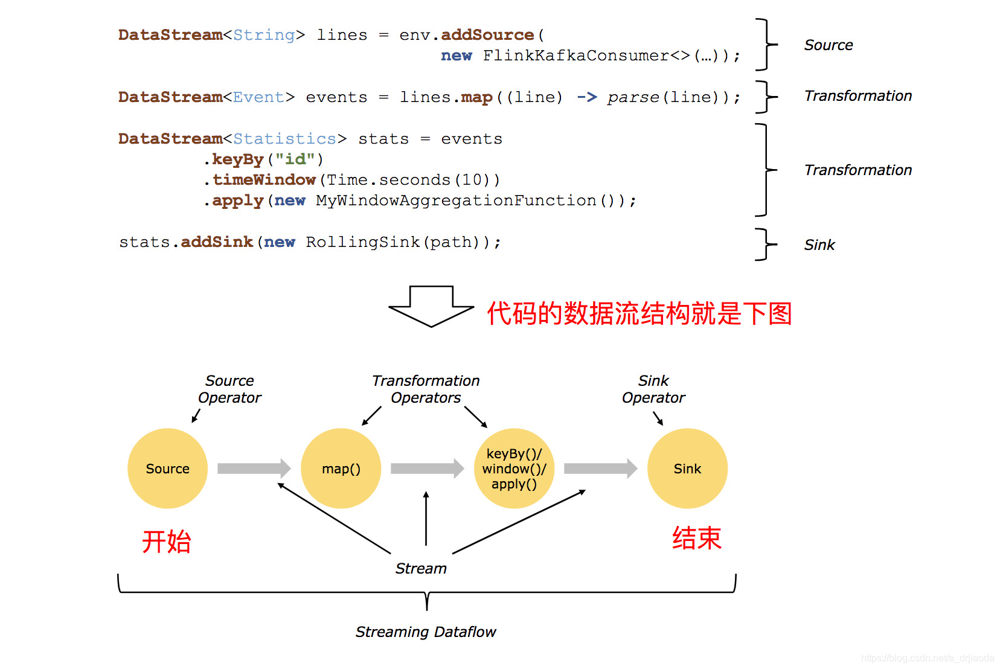

# Flink 入门

> 文档 ： http://flink.apachecn.org/#/docs/1.7-SNAPSHOT/2
>  
> 参考：https://ashiamd.github.io/docsify-notes/#/study/BigData/Flink/%E5%B0%9A%E7%A1%85%E8%B0%B7Flink%E5%85%A5%E9%97%A8%E5%88%B0%E5%AE%9E%E6%88%98-%E5%AD%A6%E4%B9%A0%E7%AC%94%E8%AE%B0
>
> Flink内存调优指南：https://zhuanlan.zhihu.com/p/125583401

## Flink简介

​		flink是一个分布式、高性能随时可用的以及准确的流处理计算框架，flink可以对**无界数据**（流处理）和**有界数据**（批处理）进行有状态计算（flink天生支持状态计算）

### Flink基石

* CheckPoint机制

  基于Chandy-Lamport算法实现了一个分布式一致性快照，从而提供了一致性的语义

* State API（状态API）

  主要包括ValueState、ListState、MapState、BroadcastState，使用State API能够自动享受到一致性。state可以认为程序的中间计算结果或者是历史计算结果；

* time：支持事件时间和处理时间进行计算，spark streaming只能按照process time进行处理。基于事件时间计算我们可以解决数据迟到和乱序等问题。

* window：提供了更加丰富的window，基于数量，session window，同样支持滚动和窗口的计算。

### 批处理与流处理

+ 流处理：无界，实时性有要求，只需对经过程序的每条数据进行处理。

+ 批处理：有界，持久，需要对全部数据进行访问处理。

spark vs flink

spark: spark生态中把所有的计算都当做批处理，spark streaming中流处理本质上也是批处理（micro batch)

flink：flink中是把批处理（有界数据集的处理）看成是一个特殊的流处理场景；flink中所有的计算都是流式计算。

## flink架构体系

### flink中的重要角色

* JobManager处理器。负责整个Flink集群任务的调度以及资源的管理，从客户端中获取提交的应用，然后根据集群中TaskManager上TaskSlot的使用情况，为提交的应用分配相应的TaskSlot资源并命令TaskManager启动从客户端获取应用。还负责心跳检测工作。
* TaskManager处理器。相当于整个集群的Slave节点，负责具体的任务执行和对应任务在每个节点上资源的申请和管理。

### 无界数据和有界数据

* 无界数据流：数据流是有一个开始但是没有结束；

* 有界数据流：数据流是有一个明确的开始和结束，数据流是有边界的。

flink处理流批处理的思想是：

​		flink支持的runtime(core分布式流计算)支持的是无界数据流，但是对flink来说可以支持批处理，只是从数据流上来说，有界数据只是无界数据流的一个特例，无界数据流只要添加边界就是有界数据流。

### Flink数据流编程模型

​		Flink提供不同级别的抽象来开发流/批处理应用程序。

* 最低级：状态流处理。允许用户自由处理来自一个或多个流的事件，并使用一致的容错状态。此外，用户可以注册事件时间和处理时间回调，允许程序实现复杂计算。
* 核心API：DataStream API(有界/无界流)和DataSet API(有界数据集)，提供了用于处理的通用模块。
* Table API：
* SQL：

## Flink集群搭建

* local模式（本地）---单机模式，一般不使用
* standalone模式---独立模式，Flink自带集群，开发测试环境使用
* yarn----计算资源统一有Hadoop yarn进行管理

## Flink运行架构

### Flink程序结构

​		Flink程序的基本构造块是**流**和**转换**。

### Task和Operator chain

​		fink中把onetoone的operator可以合并为一个operator chain，operator chain他的某个并行度就是一个subtask。

### 任务调度与执行

1. 当Flink执行executor会自动根据程序代码生成DAG数据流图
2. ActorSystem创建Actor将数据流图发送给JobManager中的Actor
3. JobManager会不断接收TaskManager的心跳消息，从而可以获得有效的TaskManager
4. JobManager通过调度器在TaskManager中调度执行Task（在Flink中，最小的调度单元是task，对应的就是一个线程。

* jobClient：用户编写的代码，flink的客户端封装好的提交任务的客户单

  主要作用：提交任务，不是flink内部的一个角色。

* jobmanager：负责接收任务的执行结果并返回给客户。

  主要作用：负责接收任务，对任务进行优化。并调度和执行任务；主要由调度器和checkpoint coordinator(ck协调器)

* taskmanager: 从jobmanager中接收task，部署到自己的slot中并执行。tm执行任务是以线程来执行（更轻量级），tm中配置好的slot，每个slot都可以执行task

### slot和slot sharing

slot：flink资源调度的单元，一般slot个数与CPU核数一样

## 流处理

### 数据源

* 从集合中读取数据
* 从数组中获取元素
* 从Kafka中获取元素
* 自定义数据源中获取数据

### Transform

#### 转换算子

#### map、flatMap、filter这三种算子称为基本转换算子

##### map

​	 来一个数据，转换成对应的一个数据

##### flatMap  

​	打散，做一个拆分，来一个数据，可以分离出多条数据

#### 聚合操作算子

##### keyBy

DataStream->KeyedStream：逻辑地将一个流拆分成不相交的分区，每个分区包含相同key的元素，在内部以hash的形式实现。

1. KeyBy会重新分区 
2. 不同的key有可能分到一起，因为是通过hash原理实现的

##### 滚动聚合算子（Rolling Aggregation）

这些算子可以针对Keyedstream的每一个支流做聚合

* sum()
* min()
* max()
* minBy()
* maxBy()

## DataStream开发

## Flink容错

