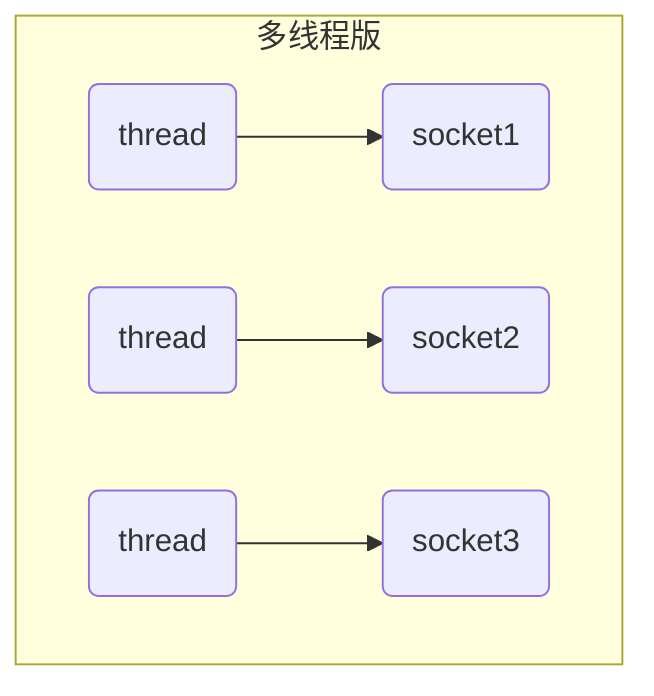
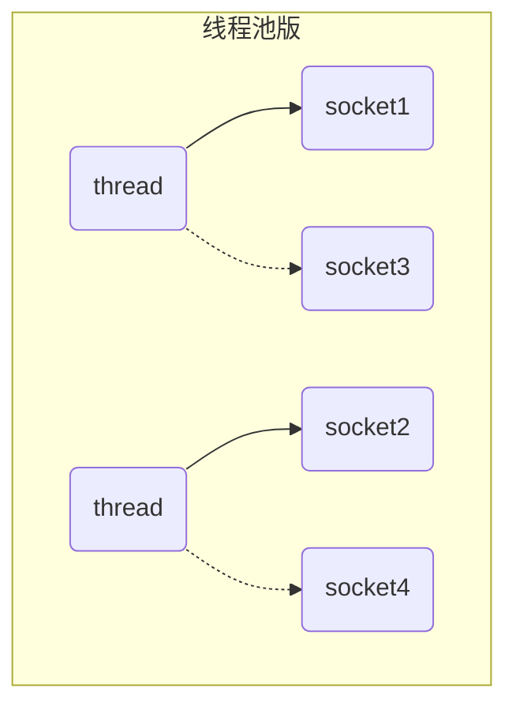
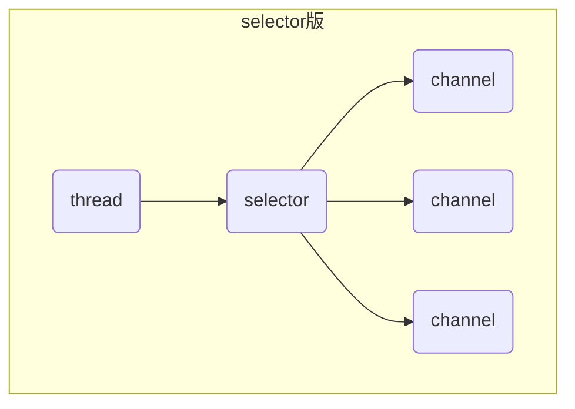

# NIO 基础

## 1. 三大组件

### 1.1 Channel & Buffer

channel有点类似于stream，是读写数据的双向通道，可以从channel将数据读入buffer，也可以将buffer的数据写入channel，而之前的stream要么是输入，要么是输出，channel比stream更为底层。

常见的Channel有：

* FileChannel(file)

* DatagramChannel(udp)

* SocketChannel(tcp)

* ServerSocketChannel(tcp)

buffer则用来缓冲读写数据，常见的buffer有

* ByteBuffer
  * MappedByteBuffer
  * DirectByteBuffer
  * HeapByteBuffer

* ShortBuffer
* ...

### 1.2 Selector

selector从字面意思不好理解，需要结合服务器设计演化来理解。

#### 多线程版缺点

* 内存占用高
* 线程上下文切换成本高
* 只适合连接数少的场景

#### 线程池版设计

#### 线程池版的缺点

* 阻塞模式下，线程仅能处理一个socket连接
* 仅适合短连接场景

#### selector版设计

selector的作用就是配合一个线程来管理多个channel，获取这些channel发生的事情，这些channel工作在非阻塞模式下，不会让线程吊死在一个channel上。适合连接数特别多，但是流量低(low traffic)的场景。

调用selector的select()会阻塞，直到channel发生了读写就绪事件，这些事件发生，select方法就返回这些事情交给线程处理。
