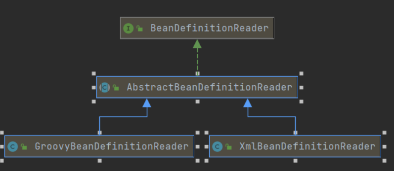

# BeanFactory

## BeanFactory的类图      

  beanFacotry是用于创建bean的工厂类。

​		其实现子类如下图：

​	

​	BeanFactory作为一个顶层的接口类，定义了一个IOC容器的基本功能规范，BeanFactory有三个重要的子类，分别是ListableBeanFactory、HierarchicalBeanFactory和AutowireCapableBeanFactory。其中DefaultListableBeanFactory实现了这三个接口。

​	ListableBeanFactory表示这些Bean可列表化，HierarchicalBeanFactory表示这些Bean之间有父子关系，AutowireCapableBeanFactory表示Bean自动装配的一些规则。

接下来我们先看BeanFactory的源码

```
public interface BeanFactory {

	// 对FactoryBean的转义定义，因为如果使用Bean的名字检索FactoryBean得到的对象是工厂生成的对象
	// 如果需要得到工厂本身，需要转义
	String FACTORY_BEAN_PREFIX = "&";

	// 根据Bean的名字拿到对应的实例
	Object getBean(String name) throws BeansException;

	// 根据Bean的名字和Class类型来获取Bean的实例，增加了类型安全检查机制
	<T> T getBean(String name, Class<T> requiredType) throws BeansException;

	/**
	 * Return an instance, which may be shared or independent, of the specified bean.
	 * <p>Allows for specifying explicit constructor arguments / factory method arguments,
	 * overriding the specified default arguments (if any) in the bean definition.
	 */
	Object getBean(String name, Object... args) throws BeansException;

	/**
	 * Return the bean instance that uniquely matches the given object type, if any.
	 */
	<T> T getBean(Class<T> requiredType) throws BeansException;

	/**
	 * Return an instance, which may be shared or independent, of the specified bean.
	 */
	<T> T getBean(Class<T> requiredType, Object... args) throws BeansException;

	/**
	 * Return a provider for the specified bean, allowing for lazy on-demand retrieval
	 * of instances, including availability and uniqueness options.
	 */
	<T> ObjectProvider<T> getBeanProvider(Class<T> requiredType);

	/**
	 * Return a provider for the specified bean, allowing for lazy on-demand retrieval
	 * of instances, including availability and uniqueness options.
	 */
	<T> ObjectProvider<T> getBeanProvider(ResolvableType requiredType);
	
	// bean容器中是否有该bean
	boolean containsBean(String name);
	// 根据bean的名字获取bean，并判断是否是单例
	boolean isSingleton(String name) throws NoSuchBeanDefinitionException;

	boolean isPrototype(String name) throws NoSuchBeanDefinitionException;

	/**
	 * Check whether the bean with the given name matches the specified type.
	 */
	boolean isTypeMatch(String name, ResolvableType typeToMatch) throws NoSuchBeanDefinitionException;

	/**
	 * Check whether the bean with the given name matches the specified type.
	 */
	boolean isTypeMatch(String name, Class<?> typeToMatch) throws NoSuchBeanDefinitionException;

	/**
	 * 得到 Bean 实例的 Class 类型
	 * Determine the type of the bean with the given name. More specifically,
	 * determine the type of object that {@link #getBean} would return for the given name.
	 */
	@Nullable
	Class<?> getType(String name) throws NoSuchBeanDefinitionException;

	@Nullable
	Class<?> getType(String name, boolean allowFactoryBeanInit) throws NoSuchBeanDefinitionException;

	/**
	 * Return the aliases for the given bean name, if any.
	 */
	String[] getAliases(String name);
```

ApplicationContext除了提供IOC容器的基本功能，还为用户提供了以下附加服务。

* 支持信息源，可以实现国际化（实现MessageSource接口）
* 访问资源（实现ResourcePatternResolver接口）
* 支持应用事件（实现ApplicationEventPublisher接口）

## Bean的定义：BeanDefinition

Spring IOC容器管理我们定义的各种Bean对象及其相互关系，Bean对象在Spring实现中以BeanDefinition来描述。其继承体系如下：


## Bean的解析：BeanDefinitionReader

BeanDefinitionReader：Bean的解析主要是对Spring配置文件的解析，这个解析过程主要通过BeanDefinitionReader来完成。结构图如下：



## ApplicationContext 类图


## Bean容器的启动

关键点：AbstractApplicationContext的refresh()方法

```java
	public void refresh() throws BeansException, IllegalStateException {
		synchronized (this.startupShutdownMonitor) {
			StartupStep contextRefresh = this.applicationStartup.start("spring.context.refresh");

			// Prepare this context for refreshing.
			// 1. 调用容器准确刷新方法，该方法用于获取容器当前时间，同时给容器设置同步标识
			prepareRefresh();

			// Tell the subclass to refresh the internal bean factory.
			// 2. 告诉子类启动refreshBeanFactory()方法，Bean定义资源文件的载入从子类的refreshBeanFactory()
			// 方法启动
			ConfigurableListableBeanFactory beanFactory = obtainFreshBeanFactory();

			// Prepare the bean factory for use in this context.
			// 3. 为BeanFactory配置容器特性，例如类加载器、事件处理器等
			prepareBeanFactory(beanFactory);

			try {
				// Allows post-processing of the bean factory in context subclasses.
				// 4. 为容器的某些子类指定特殊的post事件处理器等
				postProcessBeanFactory(beanFactory);

				StartupStep beanPostProcess = this.applicationStartup.start("spring.context.beans.post-process");
				// Invoke factory processors registered as beans in the context.
				// 5.调用所有注册的BeanFactoryPostProcessors
				invokeBeanFactoryPostProcessors(beanFactory);

				// Register bean processors that intercept bean creation.
				// 6. 为BeanFactory注册Post事件处理器
				// BeanPostProcessor是Bean后置处理器，用于监听容器触发的事件
				registerBeanPostProcessors(beanFactory);
				beanPostProcess.end(); // 记录beanPostProcess的状态，并且该状态不能再被改变

				// Initialize message source for this context.
				// 7. 初始化信息源，与国际化相关
				initMessageSource();

				// Initialize event multicaster for this context.
				// 8. 初始化容器事件传播器
				initApplicationEventMulticaster();

				// Initialize other special beans in specific context subclasses.
				// 9. 调用子类的某些特殊Bean的初始化方法
				onRefresh();

				// Check for listener beans and register them.
				// 10. 为事件传播器注册事件监听器
				registerListeners();

				// Instantiate all remaining (non-lazy-init) singletons.
				// 11. 初始化所有剩余的单例bean
				finishBeanFactoryInitialization(beanFactory);

				// Last step: publish corresponding event.
				// 12. 初始化容器的生命周期事件处理器，并发布容器的生命周期事件
				finishRefresh();
			}

			catch (BeansException ex) {
				if (logger.isWarnEnabled()) {
					logger.warn("Exception encountered during context initialization - " +
							"cancelling refresh attempt: " + ex);
				}

				// Destroy already created singletons to avoid dangling resources.
				// 13. 销毁已经创建的bean
				destroyBeans();

				// Reset 'active' flag.
				// 14. 取消刷新操作，重置容器的同步标识
				cancelRefresh(ex);

				// Propagate exception to caller.
				throw ex;
			}

			finally {
				// Reset common introspection caches in Spring's core, since we
				// might not ever need metadata for singleton beans anymore...
				// 重置公共缓存
				resetCommonCaches();
				// 上下文刷新结束
				contextRefresh.end();//记录上下文刷新状态，该状态不能再改变
			}
		}
	}
```

   ## 创建容器

​		上文的AbstractApplicationContext定义了bean容器启动的一些过程，其中第二步就是创建容器`ConfigurableListableBeanFactory beanFactory = obtainFreshBeanFactory()`，该方法调用了refreshBeanFactory()方法，该方法是一个抽象方法，由子类来实现，然后调用子类的方法来完成容器的创建。先看obtainFreshBeanFactory的代码。

```java
	protected ConfigurableListableBeanFactory obtainFreshBeanFactory() {
		refreshBeanFactory();
		return getBeanFactory();
	}
	protected abstract void refreshBeanFactory() throws BeansException, IllegalStateException;
```

我们可以到实现该方法主要有两个类：


接下来来看下AbstractRefreshableApplicationContext类中的refreshBeanFactory()方法代码：

```java
	protected final void refreshBeanFactory() throws BeansException {
		if (hasBeanFactory()) { // 如果有容器，销毁容器中的Bean，关闭容器
			destroyBeans(); // 销毁容器中的Bean
			closeBeanFactory(); // 关闭容器
		}
		try {
            // 创建IOC容器，也就是说DefaultListableBeanFactory就是用来存储bean的
			DefaultListableBeanFactory beanFactory = createBeanFactory();
			beanFactory.setSerializationId(getId());
            // 对IOC容器进行定制，如设置启动参数、开启注解的自动装配
			customizeBeanFactory(beanFactory);
            // 调用载入Bean定义的方法，在当前类中只定义了抽象的loadBeanDefinitions()方法，调用子类容器实现
            // 具体实现了该方法的类如下图loadBeanDefinitions
			loadBeanDefinitions(beanFactory);
			this.beanFactory = beanFactory;
		}
		catch (IOException ex) {
			throw new ApplicationContextException("I/O error parsing bean definition source for " + getDisplayName(), ex);
		}
	}
```


​																					图 loadBeanDefinitions

要求：Debug看看

##  装载路径配置

接着看看AbstractXmlApplicationContext类中对于loadBeanDefinitions()方法的实现

```java
//载入bean定义	
protected void loadBeanDefinitions(DefaultListableBeanFactory beanFactory) throws BeansException, IOException {
		// Create a new XmlBeanDefinitionReader for the given BeanFactory.
    	// 创建Bean读取器。通过回调设置到容器中，容器使用该读取器读取Bean配置资源
		XmlBeanDefinitionReader beanDefinitionReader = new XmlBeanDefinitionReader(beanFactory);

		// Configure the bean definition reader with this context's
		// resource loading environment. 为Bean读取器设置Spring资源加载器
		beanDefinitionReader.setEnvironment(this.getEnvironment());
    	// AbstractXmlApplicationContext的父类AbstractApplicationContext继承DefaultResurceLoader
    	// 因此，容器本身也是一个资源加载器
		beanDefinitionReader.setResourceLoader(this);
    	// 为Bean读取器设置SAX xml解析器
		beanDefinitionReader.setEntityResolver(new ResourceEntityResolver(this));

		// Allow a subclass to provide custom initialization of the reader,
		// then proceed with actually loading the bean definitions.
    	// 当Bean读取器读取到Bean定义的xml资源文件时，启用xml的校验机制
		initBeanDefinitionReader(beanDefinitionReader);
    	// 为Bean读取器真正实现加载的方法
		loadBeanDefinitions(beanDefinitionReader);
	}

	protected void initBeanDefinitionReader(XmlBeanDefinitionReader reader) {
		reader.setValidating(this.validating);
	}

	protected void loadBeanDefinitions(XmlBeanDefinitionReader reader) throws BeansException, IOException {
        // 获取Bean配置的资源定位
		Resource[] configResources = getConfigResources();
		if (configResources != null) {
            // 调用的XmlBeanDefinitionReader的父类的方法
			reader.loadBeanDefinitions(configResources);
		}
		String[] configLocations = getConfigLocations();
		if (configLocations != null) {
            // 同样调用的其父类的方法
			reader.loadBeanDefinitions(configLocations);
		}
	}
```
## 分配路径处理策略

AbstractBeanDefinitionReader类

```java
public int loadBeanDefinitions(String location, Set<Resource> actualResources) throws BeanDefinitionStoreException {
		ResourceLoader resourceLoader = getResourceLoader();
		if (resourceLoader == null) {
			throw new BeanDefinitionStoreException(
					"Cannot import bean definitions from location [" + location + "]: no ResourceLoader available");
		}

    	//resourceLoader是 ClassPathXmlApplicationContext，ClassPathXmlApplicationContext是ResourcePatternResolver的子类
		if (resourceLoader instanceof ResourcePatternResolver) { 
			// Resource pattern matching available.
			try {
                // 将指定位置的Bean配置信息解析为Spring IOC容器封装的资源
                // 加载多个指定位置的xml文件中配置的Bean信息
				Resource[] resources = ((ResourcePatternResolver) resourceLoader).getResources(location);
                // 调用子类XmlBeanDefinitionReader的方法，实现加载功能
				int loadCount = loadBeanDefinitions(resources);// 一个config的配置返回4，去了解 TODO
				if (actualResources != null) {
					for (Resource resource : resources) {
						actualResources.add(resource);
					}
				}
				if (logger.isDebugEnabled()) {
					logger.debug("Loaded " + loadCount + " bean definitions from location pattern [" + location + "]");
				}
				return loadCount;
			}
			catch (IOException ex) {
				throw new BeanDefinitionStoreException(
						"Could not resolve bean definition resource pattern [" + location + "]", ex);
			}
		}
		else {
			// Can only load single resources by absolute URL.
			Resource resource = resourceLoader.getResource(location);
			int loadCount = loadBeanDefinitions(resource);
			if (actualResources != null) {
				actualResources.add(resource);
			}
			if (logger.isDebugEnabled()) {
				logger.debug("Loaded " + loadCount + " bean definitions from location [" + location + "]");
			}
			return loadCount;
		}
	}
```

## 解析配置文件路径

​	XmlBeanDefinitionReader通过调用ClassPathXmlApplicationContext的父类DefaultResourceLoader的getResource()方法获取要加载的资源，来看看DefaultResourceLoader加载资源的方式：

```java
/**
 *  资源路径的表示方式的不同，对应着不同的配置文件加载方式
 *   1. ClassPathContextResource 2. ClassPathResource  3.UrlResource 4.FileSystemResource
 *   它们对应的路径表示是什么样？显示它们之间的差异。
**/
public Resource getResource(String location) {
		Assert.notNull(location, "Location must not be null");

		for (ProtocolResolver protocolResolver : this.protocolResolvers) {
			Resource resource = protocolResolver.resolve(location, this);
			if (resource != null) {
				return resource;
			}
		}

		if (location.startsWith("/")) {
			return getResourceByPath(location); // 通过ClassPathContextResource解析
		}
		else if (location.startsWith(CLASSPATH_URL_PREFIX)) {
			return new ClassPathResource(location.substring(CLASSPATH_URL_PREFIX.length()), getClassLoader()); // 通过ClassPathResource解析，即以" classpath*："开头
		}
		else {
			try {
				// Try to parse the location as a URL...
				URL url = new URL(location);
				return new UrlResource(url); //
			}
			catch (MalformedURLException ex) {
				// No URL -> resolve as resource path.
                // 如果既不是classpath又不是Url，就用默认的ClassPathContextResource
				return getResourceByPath(location);
			}
		}
	}

	protected Resource getResourceByPath(String path) {
		return new ClassPathContextResource(path, getClassLoader());
	}
```

## 读取配置内容

​	XmlBeanDefinitionReader的loadBeanDefinitions()

```java
    // 对读入的XML资源进行特殊编码处理
	public int loadBeanDefinitions(Resource resource) throws BeanDefinitionStoreException {
        return loadBeanDefinitions(new EncodedResource(resource));
    }
	
	// 载入XML形式Bean配置信息方法
	public int loadBeanDefinitions(EncodedResource encodedResource) throws BeanDefinitionStoreException {
		Assert.notNull(encodedResource, "EncodedResource must not be null");
		if (logger.isInfoEnabled()) {
			logger.info("Loading XML bean definitions from " + encodedResource.getResource());
		}

		Set<EncodedResource> currentResources = this.resourcesCurrentlyBeingLoaded.get();
		if (currentResources == null) {
			currentResources = new HashSet<>(4);
			this.resourcesCurrentlyBeingLoaded.set(currentResources);
		}
		if (!currentResources.add(encodedResource)) {
			throw new BeanDefinitionStoreException(
					"Detected cyclic loading of " + encodedResource + " - check your import definitions!");
		}
		try {
            // 将资源文件转化为I/O流
			InputStream inputStream = encodedResource.getResource().getInputStream();
			try {
                // 从I/O流中得到XML解析源
				InputSource inputSource = new InputSource(inputStream);
				if (encodedResource.getEncoding() != null) {
					inputSource.setEncoding(encodedResource.getEncoding());
				}
                // 具体读取过程
				return doLoadBeanDefinitions(inputSource, encodedResource.getResource());
			}
			finally {
				inputStream.close();
			}
		}
		catch (IOException ex) {
			throw new BeanDefinitionStoreException(
					"IOException parsing XML document from " + encodedResource.getResource(), ex);
		}
		finally {
			currentResources.remove(encodedResource);
			if (currentResources.isEmpty()) {
				this.resourcesCurrentlyBeingLoaded.remove();
			}
		}
	}

protected int doLoadBeanDefinitions(InputSource inputSource, Resource resource)
			throws BeanDefinitionStoreException {
		try {
            // 将xml转化为dom对象
			Document doc = doLoadDocument(inputSource, resource);
            // 启动对Bean定义解析的详细过程，该解析过程会用dao
			return registerBeanDefinitions(doc, resource);
		}
		......
		catch (Throwable ex) {
			throw new BeanDefinitionStoreException(resource.getDescription(),
					"Unexpected exception parsing XML document from " + resource, ex);
		}
	}
```

接下来是一堆解析，此处省略....

## 分配注册策略

​	    在DefaultBeanDefinitionDocumentReader对Bean的解析后，将BeanDefinition(Bean的定义)转换为BeanDefinitionHold对象，然后调用BeanDefinitionReaderUtils的registerBeanDefinition()方法向Spring IOC容器注册解析的Bean.

```java
	public static void registerBeanDefinition(
			BeanDefinitionHolder definitionHolder, BeanDefinitionRegistry registry)
			throws BeanDefinitionStoreException {

		// Register bean definition under primary name.
        // 获取Bean的名称,一般为 包名+类名
		String beanName = definitionHolder.getBeanName();
        // 向Spring容器中注入BeanDefinition
		registry.registerBeanDefinition(beanName, definitionHolder.getBeanDefinition());

		// Register aliases for bean name, if any.
        // 若有别名，则向Spring容器中注册别名
		String[] aliases = definitionHolder.getAliases();
		if (aliases != null) {
			for (String alias : aliases) {
				registry.registerAlias(beanName, alias);
			}
		}
	}
```

​	当调用BeanDefinitionReaderUtils向Spring IOC容器注册解析的BeanDefinition时，真正完成注册功能的DefaultListBeanFactory。实际上，DefaultListBeanFactory继承了BeanDefinitionRegistry。


```java
	DefaultListBeanFactory类中实现BeanDefinitionRegistry接口中的registerBeanDefinition方法
        
  	// 来看DefaultListBeanFactory中存储Bean的数据结构
    // 存储注册信息的BeanDefinition
    private final Map<String, BeanDefinition> beanDefinitionMap = new ConcurrentHashMap<String, BeanDefinition>(256);

	/** Map of singleton and non-singleton bean names, keyed by dependency type */
	// 结合getBean()来理解
	private final Map<Class<?>, String[]> allBeanNamesByType = new ConcurrentHashMap<Class<?>, String[]>(64);

	/** Map of singleton-only bean names, keyed by dependency type */
    // 同样结合getBean()来理解
	private final Map<Class<?>, String[]> singletonBeanNamesByType = new ConcurrentHashMap<Class<?>, String[]>(64);
	
    @Override
	public void registerBeanDefinition(String beanName, BeanDefinition beanDefinition)
			throws BeanDefinitionStoreException {

		Assert.hasText(beanName, "Bean name must not be empty");
		Assert.notNull(beanDefinition, "BeanDefinition must not be null");

		if (beanDefinition instanceof AbstractBeanDefinition) {
			try {
				((AbstractBeanDefinition) beanDefinition).validate();
			}
			catch (BeanDefinitionValidationException ex) {
				throw new BeanDefinitionStoreException(beanDefinition.getResourceDescription(), beanName,
						"Validation of bean definition failed", ex);
			}
		}

		BeanDefinition oldBeanDefinition;

		oldBeanDefinition = this.beanDefinitionMap.get(beanName);
		if (oldBeanDefinition != null) {
			if (!isAllowBeanDefinitionOverriding()) {
				throw new BeanDefinitionStoreException(beanDefinition.getResourceDescription(), beanName,
						"Cannot register bean definition [" + beanDefinition + "] for bean '" + beanName +
						"': There is already [" + oldBeanDefinition + "] bound.");
			}
			else if (oldBeanDefinition.getRole() < beanDefinition.getRole()) {
				// e.g. was ROLE_APPLICATION, now overriding with ROLE_SUPPORT or ROLE_INFRASTRUCTURE
				if (this.logger.isWarnEnabled()) {
					this.logger.warn("Overriding user-defined bean definition for bean '" + beanName +
							"' with a framework-generated bean definition: replacing [" +
							oldBeanDefinition + "] with [" + beanDefinition + "]");
				}
			}
			else if (!beanDefinition.equals(oldBeanDefinition)) {
				if (this.logger.isInfoEnabled()) {
					this.logger.info("Overriding bean definition for bean '" + beanName +
							"' with a different definition: replacing [" + oldBeanDefinition +
							"] with [" + beanDefinition + "]");
				}
			}
			else {
				if (this.logger.isDebugEnabled()) {
					this.logger.debug("Overriding bean definition for bean '" + beanName +
							"' with an equivalent definition: replacing [" + oldBeanDefinition +
							"] with [" + beanDefinition + "]");
				}
			}
			this.beanDefinitionMap.put(beanName, beanDefinition);
		}
		else {
			if (hasBeanCreationStarted()) {
				// Cannot modify startup-time collection elements anymore (for stable iteration)
                // 不能修改启动集合中的任何元素
				synchronized (this.beanDefinitionMap) {
					this.beanDefinitionMap.put(beanName, beanDefinition);
					List<String> updatedDefinitions = new ArrayList<String>(this.beanDefinitionNames.size() + 1);
					updatedDefinitions.addAll(this.beanDefinitionNames);
					updatedDefinitions.add(beanName);
					this.beanDefinitionNames = updatedDefinitions;
					if (this.manualSingletonNames.contains(beanName)) {
						Set<String> updatedSingletons = new LinkedHashSet<String>(this.manualSingletonNames);
						updatedSingletons.remove(beanName);
						this.manualSingletonNames = updatedSingletons;
					}
				}
			}
			else {
				// Still in startup registration phase
                // 启动注册阶段
				this.beanDefinitionMap.put(beanName, beanDefinition);
				this.beanDefinitionNames.add(beanName);
				this.manualSingletonNames.remove(beanName);
			}
			this.frozenBeanDefinitionNames = null;
		}

		if (oldBeanDefinition != null || containsSingleton(beanName)) {
			resetBeanDefinition(beanName);
		}
	}
```

# 基于注解的IOC初始化

## 注解处理策略

​	1）类级别注解，如@Component、@Respsitory、@Controller、@Service等。处理策略：根据注解过滤规则扫描读取注解Bean定义类，并将其注册到spring容器中。

​	2）类内部的注解。如@Autowired、@Value、@Resource。都是添加在类内部的字段或者方法上的类内部注解，Spring IOC容器通过Bean的后置处理器(BeanPostProcessor)解析Bean内部注解

***若使用spring boot，设置断点，对于注解的Bean，只有SpringApplication.run()方法传进去的对象进入了AnnotationBeanDefintionReader的doRegisterBean()方法？这个是为什么？***

## 定位Bean扫描路径

​	主要看AnnotationConfigApplicationContext.

先看继承的AnnotationConfigRegistry接口

```java
public interface AnnotationConfigRegistry {

	/**
	 * Register one or more annotated classes to be processed.
	 * <p>Calls to {@code register} are idempotent; adding the same
	 * annotated class more than once has no additional effect.
	 * @param annotatedClasses one or more annotated classes,
	 * e.g. {@link Configuration @Configuration} classes
	 */
	void register(Class<?>... annotatedClasses);

	/**
	 * Perform a scan within the specified base packages.
	 * @param basePackages the packages to check for annotated classes
	 */
	void scan(String... basePackages);

}
```

```
// GenericApplicationContext补充
public class AnnotationConfigApplicationContext extends GenericApplicationContext implements AnnotationConfigRegistry {

	// 读取Bean定义读取器,并将其设置到容器中
	private final AnnotatedBeanDefinitionReader reader;
	// 扫描指定类路径中注解Bean定义扫描器,并将其设置到容器中
	private final ClassPathBeanDefinitionScanner scanner;


	/**
	 * Create a new AnnotationConfigApplicationContext that needs to be populated
	 * through {@link #register} calls and then manually {@linkplain #refresh refreshed}.
	 */
	public AnnotationConfigApplicationContext() {
		this.reader = new AnnotatedBeanDefinitionReader(this);
		this.scanner = new ClassPathBeanDefinitionScanner(this);
	}

	/**
	 * Create a new AnnotationConfigApplicationContext with the given DefaultListableBeanFactory.
	 * @param beanFactory the DefaultListableBeanFactory instance to use for this context
	 */
	public AnnotationConfigApplicationContext(DefaultListableBeanFactory beanFactory) {
		super(beanFactory);
		this.reader = new AnnotatedBeanDefinitionReader(this);
		this.scanner = new ClassPathBeanDefinitionScanner(this);
	}

	/**
	 * Create a new AnnotationConfigApplicationContext, deriving bean definitions
	 * from the given annotated classes and automatically refreshing the context.
	 * @param annotatedClasses one or more annotated classes,
	 * e.g. {@link Configuration @Configuration} classes
	 * 将涉及到的配置类传递给该构造函数,实现将相应配置类中的Bean自动注册容器中
	 */
	public AnnotationConfigApplicationContext(Class<?>... annotatedClasses) {
		this();
		register(annotatedClasses);
		refresh();
	}

	/**
	 * Create a new AnnotationConfigApplicationContext, scanning for bean definitions
	 * in the given packages and automatically refreshing the context.
	 * @param basePackages the packages to check for annotated classes
	 * 自动扫描已给定的包以及其子包下的所有类,并自动识别所有的spring bean,将其注册到容器中
	 */
	public AnnotationConfigApplicationContext(String... basePackages) {
		this();
		scan(basePackages);
		refresh();
	}


	/**
	 * {@inheritDoc}
	 * <p>Delegates given environment to underlying {@link AnnotatedBeanDefinitionReader}
	 * and {@link ClassPathBeanDefinitionScanner} members.
	 */
	@Override
	public void setEnvironment(ConfigurableEnvironment environment) {
		super.setEnvironment(environment);
		this.reader.setEnvironment(environment);
		this.scanner.setEnvironment(environment);
	}

	/**
	 * Provide a custom {@link BeanNameGenerator} for use with {@link AnnotatedBeanDefinitionReader}
	 * and/or {@link ClassPathBeanDefinitionScanner}, if any.
	 * <p>Default is {@link org.springframework.context.annotation.AnnotationBeanNameGenerator}.
	 * <p>Any call to this method must occur prior to calls to {@link #register(Class...)}
	 * and/or {@link #scan(String...)}.
	 * @see AnnotatedBeanDefinitionReader#setBeanNameGenerator
	 * @see ClassPathBeanDefinitionScanner#setBeanNameGenerator
	 * 为Bean读取器和扫描器设置Bean名字产生器
	 */
	public void setBeanNameGenerator(BeanNameGenerator beanNameGenerator) {
		this.reader.setBeanNameGenerator(beanNameGenerator);
		this.scanner.setBeanNameGenerator(beanNameGenerator);
		getBeanFactory().registerSingleton(
				AnnotationConfigUtils.CONFIGURATION_BEAN_NAME_GENERATOR, beanNameGenerator);
	}

	/**
	 * Set the {@link ScopeMetadataResolver} to use for detected bean classes.
	 * <p>The default is an {@link AnnotationScopeMetadataResolver}.
	 * <p>Any call to this method must occur prior to calls to {@link #register(Class...)}
	 * and/or {@link #scan(String...)}.
	 * 为Bean读取器和扫描器设置元信息解析器
	 */
	public void setScopeMetadataResolver(ScopeMetadataResolver scopeMetadataResolver) {
		this.reader.setScopeMetadataResolver(scopeMetadataResolver);
		this.scanner.setScopeMetadataResolver(scopeMetadataResolver);
	}

	@Override
	protected void prepareRefresh() { 
		this.scanner.clearCache(); // Clear the underlying metadata cache, removing all cached class metadata.
		super.prepareRefresh(); // Prepare this context for refreshing, setting its startup date and active flag as well as performing any initialization of property sources.
	}


	//---------------------------------------------------------------------
	// Implementation of AnnotationConfigRegistry
	//---------------------------------------------------------------------

	/**
	 * Register one or more annotated classes to be processed.
	 * <p>Note that {@link #refresh()} must be called in order for the context
	 * to fully process the new classes.
	 * @param annotatedClasses one or more annotated classes,
	 * e.g. {@link Configuration @Configuration} classes
	 * @see #scan(String...)
	 * @see #refresh()
	 * 为容器注册一个要被处理的注解Bean,新注册的Bean,必须手动调用容器的refresh()方法刷新容器,触发容器对新注册Bean的处理
	 */
	public void register(Class<?>... annotatedClasses) {
		Assert.notEmpty(annotatedClasses, "At least one annotated class must be specified");
		this.reader.register(annotatedClasses);
	}

	/**
	 * Perform a scan within the specified base packages.
	 * <p>Note that {@link #refresh()} must be called in order for the context
	 * to fully process the new classes.
	 * @param basePackages the packages to check for annotated classes
	 * @see #register(Class...)
	 * @see #refresh()
	 * 扫描指定包路径及其子包下的注解类,为了使新添加的类被处理,必须手动调用refresh()方法刷新容器
	 */
	public void scan(String... basePackages) {
		Assert.notEmpty(basePackages, "At least one base package must be specified");
		this.scanner.scan(basePackages);
	}

}

```

## 读取注解元数据

AnnotationBeanDefintionReader的register()方法向容器中注册指定注解Bean。源码如下：

```java
/**
	 * Register one or more annotated classes to be processed.
	 * <p>Calls to {@code register} are idempotent; adding the same
	 * annotated class more than once has no additional effect.
	 * @param annotatedClasses one or more annotated classes,
	 * e.g. {@link Configuration @Configuration} classes
	 * 注册一个或多个注解bean定义类
	 */
	public void register(Class<?>... annotatedClasses) {
		for (Class<?> annotatedClass : annotatedClasses) {
			registerBean(annotatedClass);
		}
	}

	/**
	 * Register a bean from the given bean class, deriving its metadata from
	 * class-declared annotations.
	 * @param annotatedClass the class of the bean
	 * 注册一个注解bean定义类
	 */
	@SuppressWarnings("unchecked")
	public void registerBean(Class<?> annotatedClass) {
		registerBean(annotatedClass, null, (Class<? extends Annotation>[]) null);
	}

	/**
	 * Register a bean from the given bean class, deriving its metadata from
	 * class-declared annotations.
	 * @param annotatedClass the class of the bean
	 * @param qualifiers specific qualifier annotations to consider,
	 * in addition to qualifiers at the bean class level
	 */
	@SuppressWarnings("unchecked")
	public void registerBean(Class<?> annotatedClass, Class<? extends Annotation>... qualifiers) {
		registerBean(annotatedClass, null, qualifiers);
	}

	/**
	 * Register a bean from the given bean class, deriving its metadata from
	 * class-declared annotations.
	 * @param annotatedClass the class of the bean
	 * @param name an explicit name for the bean
	 * @param qualifiers specific qualifier annotations to consider,
	 * in addition to qualifiers at the bean class level
	 */
	@SuppressWarnings("unchecked")
	public void registerBean(Class<?> annotatedClass, String name, Class<? extends Annotation>... qualifiers) {
	   // 创建spring容器中对注解bean的封装的数据结构
		AnnotatedGenericBeanDefinition abd = new AnnotatedGenericBeanDefinition(annotatedClass);
		if (this.conditionEvaluator.shouldSkip(abd.getMetadata())) {
			return;
		}
		
		// 解析注解Bean定义的作用域，若@Scope("prototype"),则bean为原型类型，若为@Scope("singleton")，
		// 则Bean为单态类型
		ScopeMetadata scopeMetadata = this.scopeMetadataResolver.resolveScopeMetadata(abd);
		abd.setScope(scopeMetadata.getScopeName()); //设置注解bean的作用域
		// 为注解Bean生成 名称
		String beanName = (name != null ? name : this.beanNameGenerator.generateBeanName(abd, this.registry));
		// 处理注解Bean定义中的通用注解
		AnnotationConfigUtils.processCommonDefinitionAnnotations(abd);
		// 如果在向容器中注册Bean定义时，使用了额外的限定符注解，则解析限定符注解
		// 主要配置autowiring自动依赖注入装配的限定条件，即@Qualified注解
		// spring注入的时候默认按照type进行装配，若使用@Qualified则按名称进行装配
		if (qualifiers != null) {
			for (Class<? extends Annotation> qualifier : qualifiers) {
				if (Primary.class == qualifier) {
					abd.setPrimary(true); // @Primary
				}
				else if (Lazy.class == qualifier) {
					abd.setLazyInit(true); // @Lazy
				}
				else { // 如果使用了除@Primary和@Lazy以外的注解，则为该Bean添加一个autowiring自动
					// 自动注入装配限定符，该Bean在autowiring自动依赖注入装配时，根据名称装配限定符指定的Bean
					abd.addQualifier(new AutowireCandidateQualifier(qualifier));
				}
			}
		}
		// 创建一个指定Bean名称的Bean定义对象， 封装注解Bean定义的类数据。
		// 含有3个属性：beanDefinition，beanName，数组aliases（别名） 
		BeanDefinitionHolder definitionHolder = new BeanDefinitionHolder(abd, beanName);
        // 根据注解Bean定义类中的配置项创建相应代理对象
		definitionHolder = AnnotationConfigUtils.applyScopedProxyMode(scopeMetadata, definitionHolder, this.registry);
        // 向IOC容器中注册Bean
		BeanDefinitionReaderUtils.registerBeanDefinition(definitionHolder, this.registry);
	}

```

接下来主要看4个方面：

1. 使用注解元数据解析器(AnnotationScopeMetadataResolver)解析注解Bean中关于作用域的配置
2. 使用AnnotationConfigUtils的processCommonDefinitionAnnotations()方法处理注解Bean中的定义类。
3. 使用AnnotationConfigUtils的applyScopedProxyMode()方法创建作用域的代理对象。
4. 通过BeanDefinitionUtils向容器中注册Bean


AnnotationScopeMetadataResolver：

```java
	@Override
	public ScopeMetadata resolveScopeMetadata(BeanDefinition definition) {
		ScopeMetadata metadata = new ScopeMetadata();
		if (definition instanceof AnnotatedBeanDefinition) {
			AnnotatedBeanDefinition annDef = (AnnotatedBeanDefinition) definition;
            // 从注解Bean定义类的属性中查找属性为Scope的值，即@Scope注解的值
            // annDef.getMetadata()方法将Bean中所有的注解和注解的值存放在一个map集合中
			AnnotationAttributes attributes = AnnotationConfigUtils.attributesFor(
					annDef.getMetadata(), this.scopeAnnotationType);
            // 将获取的＠Scope 注解的值设置到要返回的对象中
			if (attributes != null) {
				metadata.setScopeName(attributes.getString("value"));
                ／／ 获取 Scope 注解中的 proxyMode 属性值，在创建代理对象时会用到
				ScopedProxyMode proxyMode = attributes.getEnum("proxyMode");
                ／／ 如果＠Scope proxyMode 属性为 DEFAULT 或者 NO
				if (proxyMode == null || proxyMode == ScopedProxyMode.DEFAULT) {
					proxyMode = this.defaultProxyMode;
				}
                ／／ 为返回的元数据设置 proxyMode
				metadata.setScopedProxyMode(proxyMode);
			}
		}
		return metadata;
	}
```

AnnotationConfigUtils.processCommonDefinitionAnnotations

```java
	// 处理Bean定义中的通用注解
	static void processCommonDefinitionAnnotations(AnnotatedBeanDefinition abd, AnnotatedTypeMetadata metadata) {
        // 如果 Bean 定义中有 Lazy 注解，则将该 Bean预实例化属性设置为 lazy 注解的值
		if (metadata.isAnnotated(Lazy.class.getName())) {
			abd.setLazyInit(attributesFor(metadata, Lazy.class).getBoolean("value"));
		}
		else if (abd.getMetadata() != metadata && abd.getMetadata().isAnnotated(Lazy.class.getName())) {
			abd.setLazyInit(attributesFor(abd.getMetadata(), Lazy.class).getBoolean("value"));
		}
		// 如果 Bean 定义中有 ima 注解，则将该 Bean 设直为 autowiring 自动依赖注入装配的首选对象
		if (metadata.isAnnotated(Primary.class.getName())) {
			abd.setPrimary(true);
		}
        // 如果 Bean 定义中有 Depend son 注解，则为该 Bean 设置所依赖的 Bean 名称，
		// 容器将确保在实例化该 Bean 之前首先实例化所依赖的 Bean
		if (metadata.isAnnotated(DependsOn.class.getName())) {
			abd.setDependsOn(attributesFor(metadata, DependsOn.class).getStringArray("value"));
		}

		if (abd instanceof AbstractBeanDefinition) {
			AbstractBeanDefinition absBd = (AbstractBeanDefinition) abd;
			if (metadata.isAnnotated(Role.class.getName())) {
				absBd.setRole(attributesFor(metadata, Role.class).getNumber("value").intValue());
			}
			if (metadata.isAnnotated(Description.class.getName())) {
				absBd.setDescription(attributesFor(metadata, Description.class).getString("value"));
			}
		}
	}
```

​		AnnotationConfigUtils.applyScopedProxyMode()：根据注解Bean定义类中配置的作用域@Scope注解的值，为Bean定义应用相应的代理模式。主要在Spring面向切面编程中使用。

```java
	static BeanDefinitionHolder applyScopedProxyMode(
			ScopeMetadata metadata, BeanDefinitionHolder definition, BeanDefinitionRegistry registry) {
		// 获取注解 Bean 定义类中 Scope 注解的 proxyMode 属性值
		ScopedProxyMode scopedProxyMode = metadata.getScopedProxyMode();
        // 如果配置的 Scope 注解的 proxyMode 属性值为 NO 则不应用代理模式
		if (scopedProxyMode.equals(ScopedProxyMode.NO)) {
			return definition;
		}
        // 获取配置的@Scope注解的proxyMode属性值，如果为TARGET_CLASS,则返回 true ，如果为 INTERFACES 则返回 false
		boolean proxyTargetClass = scopedProxyMode.equals(ScopedProxyMode.TARGET_CLASS);
        // 为注册的 Bean 建相应模式的代理对象
		return ScopedProxyCreator.createScopedProxy(definition, registry, proxyTargetClass);
	}
```

 BeanDefinitionReaderUtils 向容器注册 Bean

​		BeanDefinitionReaderUtils 主要校验 BeanDefinition 信息，然后将 Bean 添加到容器中管理BeanDefinition HashMap中。使用的还是DefaultListBeanFactory中的registerBeanDefinition()方法来完成注册。

注册流程如下：BeanDefinitionReaderUtils .registerBeanDefinition() --> registry.registerBeanDefinition(beanName, definitionHolder.getBeanDefinition());[registry --> GenericApplicationContext]   -->  GenericApplicationContext.registerBeanDefinition()[this.beanFactory.registerBeanDefinition(beanName, beanDefinition);-->

beanFactory为为DefaultListBeanFactory]

1. BeanDefinitionReaderUtils 

```java
public static void registerBeanDefinition(
      BeanDefinitionHolder definitionHolder, BeanDefinitionRegistry registry)
      throws BeanDefinitionStoreException {

   // Register bean definition under primary name.
   String beanName = definitionHolder.getBeanName();
    // registry --> GenericApplicationContext
   registry.registerBeanDefinition(beanName, definitionHolder.getBeanDefinition());

   // Register aliases for bean name, if any.
   String[] aliases = definitionHolder.getAliases();
   if (aliases != null) {
      for (String alias : aliases) {
         registry.registerAlias(beanName, alias);
      }
   }
}
```

2. GenericApplicationContext

```
public void registerBeanDefinition(String beanName, BeanDefinition beanDefinition)
      throws BeanDefinitionStoreException {
	// beanFactory 为DefaultListBeanFactory
   this.beanFactory.registerBeanDefinition(beanName, beanDefinition);
}
```

## 扫描指定包解析并解析为BeanDefinition

​	也就是实现AnnotationConfigResigtry中的void scan(String... basePackages)，实现类为ClassPathBeanDefinitionScanner扫描给定的包及其子包下所有的类，主要源码如下：

ClassPathBeanDefinitionScanner：

```java
	private final BeanDefinitionRegistry registry;

	private BeanDefinitionDefaults beanDefinitionDefaults = new BeanDefinitionDefaults();

	private String[] autowireCandidatePatterns;

	private BeanNameGenerator beanNameGenerator = new AnnotationBeanNameGenerator();

	private ScopeMetadataResolver scopeMetadataResolver = new AnnotationScopeMetadataResolver();

	private boolean includeAnnotationConfig = true;
	
	/**
	 *  创建一个类路径Bean定义扫描器
	 * Create a new {@code ClassPathBeanDefinitionScanner} for the given bean factory.
	 * @param registry the {@code BeanFactory} to load bean definitions into, in the form
	 * of a {@code BeanDefinitionRegistry}
	 */
	public ClassPathBeanDefinitionScanner(BeanDefinitionRegistry registry) {
		this(registry, true);
	}
	
	// 为容器创建一个类路径Bean定义扫描器，并指定是否使用默认的扫描过滤规则，即Spring默认扫描配置@Component、@Repository
	// @Service、@Controller注解的Bean，同时也支持Java EE6的@ManagedBean和JSR-330的@Named注解
	public ClassPathBeanDefinitionScanner(BeanDefinitionRegistry registry, boolean useDefaultFilters) {
		this(registry, useDefaultFilters, getOrCreateEnvironment(registry));
	}

	// 
	public ClassPathBeanDefinitionScanner(BeanDefinitionRegistry registry, boolean useDefaultFilters,
			Environment environment) {

		this(registry, useDefaultFilters, environment,
				(registry instanceof ResourceLoader ? (ResourceLoader) registry : null));
	}

	public ClassPathBeanDefinitionScanner(BeanDefinitionRegistry registry, boolean useDefaultFilters,
			Environment environment, ResourceLoader resourceLoader) {

		Assert.notNull(registry, "BeanDefinitionRegistry must not be null");
        // 为容器设置加载Bean定义的注册器
		this.registry = registry;

		if (useDefaultFilters) {
			registerDefaultFilters(); // 注册默认过滤器
		}
		setEnvironment(environment); 
		setResourceLoader(resourceLoader); // 为容器设置资源加载器
	}

	// 调用类路径Bean定义扫描器入口方法
	public int scan(String... basePackages) {
        // 获取容器中已经注册的Bean的个数
		int beanCountAtScanStart = this.registry.getBeanDefinitionCount();

		doScan(basePackages);  // 启动扫描器扫描给定包

		// Register annotation config processors, if necessary.
        // 注册 注解配置处理器
		if (this.includeAnnotationConfig) {
			AnnotationConfigUtils.registerAnnotationConfigProcessors(this.registry);
		}
		
        // 返回注册的Bean的个数
		return (this.registry.getBeanDefinitionCount() - beanCountAtScanStart); 
	}

	// 类路径Bean定义扫描器扫描给定包及其子包
	protected Set<BeanDefinitionHolder> doScan(String... basePackages) {
		Assert.notEmpty(basePackages, "At least one base package must be specified");
        // 创建一个集合，存储扫描到的BeanDefinition的封装类
		Set<BeanDefinitionHolder> beanDefinitions = new LinkedHashSet<BeanDefinitionHolder>();
		for (String basePackage : basePackages) {// 遍历扫描所有给定的包
            // 调用父类ClassPathScanningCandidateComponentProvider的方法
            // 扫描给定类路径，获取符合条件的Bean定义--> *****重点看，是如何处理的****
			Set<BeanDefinition> candidates = findCandidateComponents(basePackage); 
			for (BeanDefinition candidate : candidates) { //遍历扫描到的Bean
                // 获取Bean的作用域
				ScopeMetadata scopeMetadata = this.scopeMetadataResolver.resolveScopeMetadata(candidate);
				candidate.setScope(scopeMetadata.getScopeName()); // 设置Bean的作用域
                // 为Bean生成名称
				String beanName = this.beanNameGenerator.generateBeanName(candidate, this.registry);
                // 如果扫描的Bean不是Spring注解的Bean，则为Bean设为默认值 ？？？
                // 设置Bean自动依赖注入装配属性等--> 该类实现了BenDefinition接口中大部分的方法，一般自我实现可以基于此进行
				if (candidate instanceof AbstractBeanDefinition) {
					postProcessBeanDefinition((AbstractBeanDefinition) candidate, beanName);
				}
                // 如果是Spring注解的Bean
				if (candidate instanceof AnnotatedBeanDefinition) {
					AnnotationConfigUtils.processCommonDefinitionAnnotations((AnnotatedBeanDefinition) candidate);
				}
                // 根据Bean名称检查指定的Bean是否需要在容器中注册，或者是否在容器中存在冲突
				if (checkCandidate(beanName, candidate)) {
					BeanDefinitionHolder definitionHolder = new BeanDefinitionHolder(candidate, beanName);
					// 根据注解中配置的作用域，为Bean应用相应代理模式
                    definitionHolder =
							AnnotationConfigUtils.applyScopedProxyMode(scopeMetadata, definitionHolder, this.registry);
					beanDefinitions.add(definitionHolder);
                    // 注册扫描到的Bean
					registerBeanDefinition(definitionHolder, this.registry);
				}
			}
		}
		return beanDefinitions;
	}

	protected void postProcessBeanDefinition(AbstractBeanDefinition beanDefinition, String beanName) {
		beanDefinition.applyDefaults(this.beanDefinitionDefaults);
		if (this.autowireCandidatePatterns != null) {
            beanDefinition.setAutowireCandidate(PatternMatchUtils.simpleMatch(this.autowireCandidatePatterns, beanName));
		}
	}

	
	
	
```

2. ClassPathScanningCandidateComponetProvider类的findCandidateComponents()方法具体实现如下：

```java
	static final String DEFAULT_RESOURCE_PATTERN = "**/*.class";


	protected final Log logger = LogFactory.getLog(getClass());

	private String resourcePattern = DEFAULT_RESOURCE_PATTERN;

	// 保存过滤规则包含的注解，即 Spring 默认的@Component、@Repository、@Service
	// @Controller注解的Bean，以及Java EE的@Managed Bean和JSR-330的@Named 注解
	private final List<TypeFilter> includeFilters = new LinkedList<TypeFilter>();

	private final List<TypeFilter> excludeFilters = new LinkedList<TypeFilter>();

	private Environment environment;

	private ConditionEvaluator conditionEvaluator;

	private ResourcePatternResolver resourcePatternResolver;

	private MetadataReaderFactory metadataReaderFactory;

	protected ClassPathScanningCandidateComponentProvider() {
	}
	
	public ClassPathScanningCandidateComponentProvider(boolean useDefaultFilters) {
		this(useDefaultFilters, new StandardEnvironment());
	}
	
	public ClassPathScanningCandidateComponentProvider(boolean useDefaultFilters, Environment environment) {
		if (useDefaultFilters) { // 如果使用默认规则，则向容器中注册过滤规则
			registerDefaultFilters(); //****看下实现****
		}
		setEnvironment(environment);
		setResourceLoader(null);
	}
	
	// 注册默认过滤器规则
	protected void registerDefaultFilters() {
        
		this.includeFilters.add(new AnnotationTypeFilter(Component.class)); // 添加Component
		ClassLoader cl = ClassPathScanningCandidateComponentProvider.class.getClassLoader();
		try {
			this.includeFilters.add(new AnnotationTypeFilter(
					((Class<? extends Annotation>) ClassUtils.forName("javax.annotation.ManagedBean", cl)), false));
			logger.debug("JSR-250 'javax.annotation.ManagedBean' found and supported for component scanning");
		}
		catch (ClassNotFoundException ex) {
			// JSR-250 1.1 API (as included in Java EE 6) not available - simply skip.
		}
		try {
			this.includeFilters.add(new AnnotationTypeFilter(
					((Class<? extends Annotation>) ClassUtils.forName("javax.inject.Named", cl)), false));
			logger.debug("JSR-330 'javax.inject.Named' annotation found and supported for component scanning");
		}
		catch (ClassNotFoundException ex) {
			// JSR-330 API not available - simply skip.
		}
	}
	
	
	/**
	 * Return the MetadataReaderFactory used by this component provider.
	 */
	public final MetadataReaderFactory getMetadataReaderFactory() { // @Bean还是什么？
		return this.metadataReaderFactory;
	}

	/**
	 * Scan the class path for candidate components.
	 * @param basePackage the package to check for annotated classes
	 * @return a corresponding Set of autodetected bean definitions
	 */
	public Set<BeanDefinition> findCandidateComponents(String basePackage) {
		Set<BeanDefinition> candidates = new LinkedHashSet<BeanDefinition>();
		try {
			String packageSearchPath = ResourcePatternResolver.CLASSPATH_ALL_URL_PREFIX +
					resolveBasePackage(basePackage) + '/' + this.resourcePattern;
			Resource[] resources = this.resourcePatternResolver.getResources(packageSearchPath);
			boolean traceEnabled = logger.isTraceEnabled();
			boolean debugEnabled = logger.isDebugEnabled();
			for (Resource resource : resources) {
				if (traceEnabled) {
					logger.trace("Scanning " + resource);
				}
				if (resource.isReadable()) {
					try {
                        // 为指定资源获取元数据读取器，元数据读取器通过ASM读取资源元信息
						MetadataReader metadataReader = this.metadataReaderFactory.getMetadataReader(resource);
                        // 如果扫描到的类符合容器配置的过滤规则
						if (isCandidateComponent(metadataReader)) {
                            // 通过ASM读取资源字节码中的 Bean 定义的元信息
							ScannedGenericBeanDefinition sbd = new ScannedGenericBeanDefinition(metadataReader); // 生成ScannedGenericBeanDefinition注入到容器中
							sbd.setResource(resource);
							sbd.setSource(resource);
							if (isCandidateComponent(sbd)) {
								if (debugEnabled) {
									logger.debug("Identified candidate component class: " + resource);
								}
								candidates.add(sbd);
							}
							else {
								if (debugEnabled) {
									logger.debug("Ignored because not a concrete top-level class: " + resource);
								}
							}
						}
						else {
							if (traceEnabled) {
								logger.trace("Ignored because not matching any filter: " + resource);
							}
						}
					}
					catch (Throwable ex) {
						throw new BeanDefinitionStoreException(
								"Failed to read candidate component class: " + resource, ex);
					}
				}
				else {
					if (traceEnabled) {
						logger.trace("Ignored because not readable: " + resource);
					}
				}
			}
		}
		catch (IOException ex) {
			throw new BeanDefinitionStoreException("I/O failure during classpath scanning", ex);
		}
		return candidates;
	}
	
	
```

# ＩＯＣ容器初始化总结

1) 初始化入口由容器中的refresh()方法来调用

2) 对Bean定义载入IOC容器使用的方法是loadBeanDefinition()

​	使用ResourceLoader完成资源文件的定位,DefaultResourceLoader是默认的实现,同时上下文(ApplicationContext)本身就给出了ResourceLoader的实现,可以通过类路径、文件系统、URL等方式来定位文件资源。

# 依赖注入

AbstractBeanFactory:

```java
	protected <T> T doGetBean(final String name, @Nullable final Class<T> requiredType,
			@Nullable final Object[] args, boolean typeCheckOnly) throws BeansException {
		
        // 这里是将FactoryBean的前缀去掉以及将别名转为真实的名字。前缀为&
		final String beanName = transformedBeanName(name);
		Object bean;

		// Eagerly check singleton cache for manually registered singletons.
        // 先从缓存中读取是否已经有被创建过的单例模式的Bean
        // 对于单例模式的Bean，整个IOC容器中只创建一次
		Object sharedInstance = getSingleton(beanName);
		if (sharedInstance != null && args == null) {
			if (logger.isDebugEnabled()) {		
				if (isSingletonCurrentlyInCreation(beanName)) {
					logger.debug("Returning eagerly cached instance of singleton bean '" + beanName +
							"' that is not fully initialized yet - a consequence of a circular reference");
				}
				else {
					logger.debug("Returning cached instance of singleton bean '" + beanName + "'");
				}
			}
             // Spring其实手动注册了一些单例bean。getSingleton(beanName);这一步就是检测是不是这些bean。
            // 如果是，那么再检测是不是工厂bean，如果是返回其工厂方法返回的实例，如果不是返回bean本身。	
            // 获取给定 Bean 的实例对象，主要完成FactoryBean的相关处理
			bean = getObjectForBeanInstance(sharedInstance, name, beanName, null);
		}

		else {
			// Fail if we're already creating this bean instance:
			// We're assumably within a circular reference.
            // 缓存中有原型模型Bean，循环引用导致实例化失败
			if (isPrototypeCurrentlyInCreation(beanName)) {
				throw new BeanCurrentlyInCreationException(beanName);
			}

			// Check if bean definition exists in this factory.
            // 如果父容器存在并且存在此bean定义，那么交由其父容器初始化:
			BeanFactory parentBeanFactory = getParentBeanFactory();
            // 检查Bean是否存在当前容器中，若不存在，则委托当前容器的父容器去查找
			if (parentBeanFactory != null && !containsBeanDefinition(beanName)) {
				// Not found -> check parent.
                // 上面transformedBeanName的逆操作
				String nameToLookup = originalBeanName(name);
				if (parentBeanFactory instanceof AbstractBeanFactory) {
					return ((AbstractBeanFactory) parentBeanFactory).doGetBean(
							nameToLookup, requiredType, args, typeCheckOnly);
				}
				else if (args != null) {
					// Delegation to parent with explicit args.
                     // 委派父容器根据指定名称和显示参数查找
					return (T) parentBeanFactory.getBean(nameToLookup, args);
				}
				else {
					// No args -> delegate to standard getBean method.
                    // 委派父容器根据指定名称和类型查找
					return parentBeanFactory.getBean(nameToLookup, requiredType);
				}
			}

            // 创建的Bean是否需要进行类型验证，一般不需要
			if (!typeCheckOnly) {
                // 向容器标记指定Bean的
				markBeanAsCreated(beanName);
			}

			try {
                // 根据指定Bean名称获取其父级Bean定义
                // 主要解决Bean继承时，子类和父类公共属性问题
				final RootBeanDefinition mbd = getMergedLocalBeanDefinition(beanName);
				checkMergedBeanDefinition(mbd, beanName, args);

				// Guarantee initialization of beans that the current bean depends on.
                // 获取当前Bean所有依赖的Bean，保证其初始化
				String[] dependsOn = mbd.getDependsOn();
				if (dependsOn != null) {
					for (String dep : dependsOn) {
						if (isDependent(beanName, dep)) { // 检测是否有循环依赖
							throw new BeanCreationException(mbd.getResourceDescription(), beanName,
									"Circular depends-on relationship between '" + beanName + "' and '" + dep + "'");
						}
						registerDependentBean(dep, beanName);// 注册被依赖的Bean
						getBean(dep); // 获取当前依赖的Bean
					}
				}

				// Create bean instance.
				if (mbd.isSingleton()) { // 创建单例模式Bean实例
					sharedInstance = getSingleton(beanName, () -> {
						try {
                            // 创建一个Bean的实例对象，如果有父类继承，则合并子类和父类的定义
							return createBean(beanName, mbd, args);
						}
						catch (BeansException ex) {
							// Explicitly remove instance from singleton cache: It might have been put there
							// eagerly by the creation process, to allow for circular reference resolution.
							// Also remove any beans that received a temporary reference to the bean.
							destroySingleton(beanName); // 清除容器中单例模式的Bean缓存实例对象
							throw ex;
						}
					});
                    // 获取给定 Bean 的实例对象，和上面if的判断一样
					bean = getObjectForBeanInstance(sharedInstance, name, beanName, mbd);
				}

				else if (mbd.isPrototype()) { // 原型，每次调用该对象中的方法，都会创建一个对象
					// It's a prototype -> create a new instance.
					Object prototypeInstance = null;
					try {
                        // 回调 beforePrototypeCreation()方法,默认的功能是注册当前原型对象
						beforePrototypeCreation(beanName);
                        // 创建指定 Bean 的对象实例
						prototypeInstance = createBean(beanName, mbd, args);
					}
					finally {
                        // 回调afterPrototypeCreation()方法，默认的功能是告诉IoC容器不再创建指定Bean的原型对象
						afterPrototypeCreation(beanName);
					}
                    // 
					bean = getObjectForBeanInstance(prototypeInstance, name, beanName, mbd);
				}

				else { // 其他scope，如request、session、application
					String scopeName = mbd.getScope();
					final Scope scope = this.scopes.get(scopeName);
					if (scope == null) {
						throw new IllegalStateException("No Scope registered for scope name '" + scopeName + "'");
					}
					try { // 这里又使用了一个匿名内部类，获取 个指定生命周期范围的实例
						Object scopedInstance = scope.get(beanName, () -> {
							beforePrototypeCreation(beanName);
							try {
								return createBean(beanName, mbd, args);
							}
							finally {
								afterPrototypeCreation(beanName);
							}
						});
						bean = getObjectForBeanInstance(scopedInstance, name, beanName, mbd);
					}
					catch (IllegalStateException ex) {
						throw new BeanCreationException(beanName,
								"Scope '" + scopeName + "' is not active for the current thread; consider " +
								"defining a scoped proxy for this bean if you intend to refer to it from a singleton",
								ex);
					}
				}
			}
			catch (BeansException ex) {
				cleanupAfterBeanCreationFailure(beanName);
				throw ex;
			}
		}

		// Check if required type matches the type of the actual bean instance.
		if (requiredType != null && !requiredType.isInstance(bean)) {
			try {
				T convertedBean = getTypeConverter().convertIfNecessary(bean, requiredType);
				if (convertedBean == null) {
					throw new BeanNotOfRequiredTypeException(name, requiredType, bean.getClass());
				}
				return convertedBean;
			}
			catch (TypeMismatchException ex) {
				if (logger.isDebugEnabled()) {
					logger.debug("Failed to convert bean '" + name + "' to required type '" +
							ClassUtils.getQualifiedName(requiredType) + "'", ex);
				}
				throw new BeanNotOfRequiredTypeException(name, requiredType, bean.getClass());
			}
		}
		return (T) bean;
	}
```

​		重点：上述代码根据不同的Scope来创建对象，对于不同的作用域，采取了不同的策略。具体Bean实例对象创建的过程由ObjectFactory接口的匿名内部类的createBean()方法完成，ObjectFactory接口使用委派模式，具体Bean的创建由AbstractAutowireCapableBeanFacotry完成。

# bean的创建（创建实例对象）

源码位于AbstractAutowireCapableBeanFactory.createBean()方法

```java
	protected Object createBean(String beanName, RootBeanDefinition mbd, @Nullable Object[] args)
			throws BeanCreationException {

		if (logger.isDebugEnabled()) {
			logger.debug("Creating instance of bean '" + beanName + "'");
		}
		RootBeanDefinition mbdToUse = mbd;

		// Make sure bean class is actually resolved at this point, and
		// clone the bean definition in case of a dynamically resolved Class
		// which cannot be stored in the shared merged bean definition.
        // 判断需要创建的Bean是否可以实例化，即是否可以通过当前类加载器加载
		Class<?> resolvedClass = resolveBeanClass(mbd, beanName);
		if (resolvedClass != null && !mbd.hasBeanClass() && mbd.getBeanClassName() != null) {
			mbdToUse = new RootBeanDefinition(mbd);
			mbdToUse.setBeanClass(resolvedClass);
		}

		// Prepare method overrides.
		try {
            // 用于检测lookup-method标签配置的方法是否存在
			mbdToUse.prepareMethodOverrides();
		}
		catch (BeanDefinitionValidationException ex) {
			throw new BeanDefinitionStoreException(mbdToUse.getResourceDescription(),
					beanName, "Validation of method overrides failed", ex);
		}

		try {
			// Give BeanPostProcessors a chance to return a proxy instead of the target bean instance.
            // 返回一个代理类，而不是目标bean，这样就可以实现下面BeanPostProcessor方法的使用
            // 在这里触发的是其postProcessBeforeInitialization和postProcessAfterInstantiation方法。
			Object bean = resolveBeforeInstantiation(beanName, mbdToUse);
			if (bean != null) {
				return bean;
			}
		}
		catch (Throwable ex) {
			throw new BeanCreationException(mbdToUse.getResourceDescription(), beanName,
					"BeanPostProcessor before instantiation of bean failed", ex);
		}

		try {
            // 创建Bean
			Object beanInstance = doCreateBean(beanName, mbdToUse, args);
			if (logger.isDebugEnabled()) {
				logger.debug("Finished creating instance of bean '" + beanName + "'");
			}
			return beanInstance;
		}
		catch (BeanCreationException ex) {
			// A previously detected exception with proper bean creation context already...
			throw ex;
		}
		catch (ImplicitlyAppearedSingletonException ex) {
			// An IllegalStateException to be communicated up to DefaultSingletonBeanRegistry...
			throw ex;
		}
		catch (Throwable ex) {
			throw new BeanCreationException(
					mbdToUse.getResourceDescription(), beanName, "Unexpected exception during bean creation", ex);
		}
	}
```

Object bean = resolveBeforeInstantiation(beanName, mbdToUse);

```
	protected Object resolveBeforeInstantiation(String beanName, RootBeanDefinition mbd) {
		Object bean = null;
		if (!Boolean.FALSE.equals(mbd.beforeInstantiationResolved)) {
			// Make sure bean class is actually resolved at this point.
			if (!mbd.isSynthetic() && hasInstantiationAwareBeanPostProcessors()) {
				Class<?> targetType = determineTargetType(beanName, mbd);
				if (targetType != null) {
					bean = applyBeanPostProcessorsBeforeInstantiation(targetType, beanName);
					if (bean != null) {
						bean = applyBeanPostProcessorsAfterInitialization(bean, beanName);
					}
				}
			}
			mbd.beforeInstantiationResolved = (bean != null);
		}
		return bean;
	}
```

Object beanInstance = doCreateBean(beanName, mbdToUse, args);

```java
protected Object doCreateBean(final String beanName, final RootBeanDefinition mbd, final @Nullable Object[] args)
			throws BeanCreationException {

		// Instantiate the bean.
		// 封装被创建的Bean对象
		BeanWrapper instanceWrapper = null;
		if (mbd.isSingleton()) {
			instanceWrapper = this.factoryBeanInstanceCache.remove(beanName);
		}
		if (instanceWrapper == null) {
			// 关键代码
			instanceWrapper = createBeanInstance(beanName, mbd, args);
		}
		final Object bean = instanceWrapper.getWrappedInstance();
		// 获取实例化对象的类型
		Class<?> beanType = instanceWrapper.getWrappedClass();
		if (beanType != NullBean.class) {
			mbd.resolvedTargetType = beanType;
		}

		// Allow post-processors to modify the merged bean definition.
		// 后置处理器
		synchronized (mbd.postProcessingLock) {
			if (!mbd.postProcessed) {
				try {
					applyMergedBeanDefinitionPostProcessors(mbd, beanType, beanName);
				}
				catch (Throwable ex) {
					throw new BeanCreationException(mbd.getResourceDescription(), beanName,
							"Post-processing of merged bean definition failed", ex);
				}
				mbd.postProcessed = true;
			}
		}

		// Eagerly cache singletons to be able to resolve circular references
		// even when triggered by lifecycle interfaces like BeanFactoryAware.
		// 向容器中缓存单例模式的 Bean 对象，以防止循环引用
		boolean earlySingletonExposure = (mbd.isSingleton() && this.allowCircularReferences &&
				isSingletonCurrentlyInCreation(beanName));
		if (earlySingletonExposure) {
			if (logger.isDebugEnabled()) {
				logger.debug("Eagerly caching bean '" + beanName +
						"' to allow for resolving potential circular references");
			}
			// 这里是一 匿名 部类 为了防止循环引用，尽早持有对象的引用
			addSingletonFactory(beanName, () -> getEarlyBeanReference(beanName, mbd, bean));
		}

		// Initialize the bean instance.
		Object exposedObject = bean;
		try {
			populateBean(beanName, mbd, instanceWrapper);
			exposedObject = initializeBean(beanName, exposedObject, mbd);
		}
		catch (Throwable ex) {
			if (ex instanceof BeanCreationException && beanName.equals(((BeanCreationException) ex).getBeanName())) {
				throw (BeanCreationException) ex;
			}
			else {
				throw new BeanCreationException(
						mbd.getResourceDescription(), beanName, "Initialization of bean failed", ex);
			}
		}

		if (earlySingletonExposure) {
			Object earlySingletonReference = getSingleton(beanName, false);
			if (earlySingletonReference != null) {
				if (exposedObject == bean) {
					exposedObject = earlySingletonReference;
				}
				else if (!this.allowRawInjectionDespiteWrapping && hasDependentBean(beanName)) {
					String[] dependentBeans = getDependentBeans(beanName);
					Set<String> actualDependentBeans = new LinkedHashSet<>(dependentBeans.length);
					for (String dependentBean : dependentBeans) {
						if (!removeSingletonIfCreatedForTypeCheckOnly(dependentBean)) {
							actualDependentBeans.add(dependentBean);
						}
					}
					if (!actualDependentBeans.isEmpty()) {
						throw new BeanCurrentlyInCreationException(beanName,
								"Bean with name '" + beanName + "' has been injected into other beans [" +
								StringUtils.collectionToCommaDelimitedString(actualDependentBeans) +
								"] in its raw version as part of a circular reference, but has eventually been " +
								"wrapped. This means that said other beans do not use the final version of the " +
								"bean. This is often the result of over-eager type matching - consider using " +
								"'getBeanNamesOfType' with the 'allowEagerInit' flag turned off, for example.");
					}
				}
			}
		}

		// Register bean as disposable.
		try {
			registerDisposableBeanIfNecessary(beanName, bean, mbd);
		}
		catch (BeanDefinitionValidationException ex) {
			throw new BeanCreationException(
					mbd.getResourceDescription(), beanName, "Invalid destruction signature", ex);
		}

		return exposedObject;
	}
```

上面的关键代码：createInstance()，生成Bean所包含java实例对象

​								populateBean(), 对Bean属性的依赖注入进行处理

```java
createInstance:
	protected BeanWrapper createBeanInstance(String beanName, RootBeanDefinition mbd, @Nullable Object[] args) {
		// Make sure bean class is actually resolved at this point.
		Class<?> beanClass = resolveBeanClass(mbd, beanName);

		if (beanClass != null && !Modifier.isPublic(beanClass.getModifiers()) && !mbd.isNonPublicAccessAllowed()) {
			throw new BeanCreationException(mbd.getResourceDescription(), beanName,
					"Bean class isn't public, and non-public access not allowed: " + beanClass.getName());
		}

		Supplier<?> instanceSupplier = mbd.getInstanceSupplier();
		if (instanceSupplier != null) {
			return obtainFromSupplier(instanceSupplier, beanName);
		}

		if (mbd.getFactoryMethodName() != null)  {
			return instantiateUsingFactoryMethod(beanName, mbd, args);
		}

		// Shortcut when re-creating the same bean...
		boolean resolved = false;
		boolean autowireNecessary = false;
		if (args == null) {
			synchronized (mbd.constructorArgumentLock) {
				if (mbd.resolvedConstructorOrFactoryMethod != null) {
					resolved = true;
					autowireNecessary = mbd.constructorArgumentsResolved;
				}
			}
		}
		if (resolved) {
			if (autowireNecessary) {
				return autowireConstructor(beanName, mbd, null, null);
			}
			else {
				return instantiateBean(beanName, mbd);
			}
		}

		// Need to determine the constructor...
		Constructor<?>[] ctors = determineConstructorsFromBeanPostProcessors(beanClass, beanName);
		if (ctors != null ||
				mbd.getResolvedAutowireMode() == RootBeanDefinition.AUTOWIRE_CONSTRUCTOR ||
				mbd.hasConstructorArgumentValues() || !ObjectUtils.isEmpty(args))  {
			return autowireConstructor(beanName, mbd, ctors, args);
		}

		// No special handling: simply use no-arg constructor.
		return instantiateBean(beanName, mbd);
	}
```

```java
populateBean:

	/**
	 * Populate the bean instance in the given BeanWrapper with the property values
	 * from the bean definition.
	 * @param beanName the name of the bean
	 * @param mbd the bean definition for the bean
	 * @param bw BeanWrapper with bean instance
	 */
	protected void populateBean(String beanName, RootBeanDefinition mbd, @Nullable BeanWrapper bw) {
		if (bw == null) {
			if (mbd.hasPropertyValues()) {
				throw new BeanCreationException(
						mbd.getResourceDescription(), beanName, "Cannot apply property values to null instance");
			}
			else {
				// Skip property population phase for null instance.
				return;
			}
		}

		// Give any InstantiationAwareBeanPostProcessors the opportunity to modify the
		// state of the bean before properties are set. This can be used, for example,
		// to support styles of field injection.
		boolean continueWithPropertyPopulation = true;

		if (!mbd.isSynthetic() && hasInstantiationAwareBeanPostProcessors()) {
			for (BeanPostProcessor bp : getBeanPostProcessors()) {
				if (bp instanceof InstantiationAwareBeanPostProcessor) {
					InstantiationAwareBeanPostProcessor ibp = (InstantiationAwareBeanPostProcessor) bp;
					if (!ibp.postProcessAfterInstantiation(bw.getWrappedInstance(), beanName)) {
						continueWithPropertyPopulation = false;
						break;
					}
				}
			}
		}

		if (!continueWithPropertyPopulation) {
			return;
		}

        // 注入Bean依赖的属性
		PropertyValues pvs = (mbd.hasPropertyValues() ? mbd.getPropertyValues() : null);

		if (mbd.getResolvedAutowireMode() == RootBeanDefinition.AUTOWIRE_BY_NAME ||
				mbd.getResolvedAutowireMode() == RootBeanDefinition.AUTOWIRE_BY_TYPE) {
			MutablePropertyValues newPvs = new MutablePropertyValues(pvs);

			// Add property values based on autowire by name if applicable.
			if (mbd.getResolvedAutowireMode() == RootBeanDefinition.AUTOWIRE_BY_NAME) {
				autowireByName(beanName, mbd, bw, newPvs); //根据名称自动注入
			}

			// Add property values based on autowire by type if applicable.
			if (mbd.getResolvedAutowireMode() == RootBeanDefinition.AUTOWIRE_BY_TYPE) {
				autowireByType(beanName, mbd, bw, newPvs); //根据类型自动注入
			}

			pvs = newPvs;
		}
......
	}
```

autowireByName：

```java
	protected void autowireByName(
			String beanName, AbstractBeanDefinition mbd, BeanWrapper bw, MutablePropertyValues pvs) {

		String[] propertyNames = unsatisfiedNonSimpleProperties(mbd, bw);
		for (String propertyName : propertyNames) {
			if (containsBean(propertyName)) {
				Object bean = getBean(propertyName);
				pvs.add(propertyName, bean); // 将属性赋值为引用的对象
                // DefaultSingletonBeanRegistry中的方法
				registerDependentBean(propertyName, beanName); // 将依赖的Bean注入到容器中，      		
				if (logger.isDebugEnabled()) {
					logger.debug("Added autowiring by name from bean name '" + beanName +
							"' via property '" + propertyName + "' to bean named '" + propertyName + "'");
				}
			}
			else {
				if (logger.isTraceEnabled()) {
					logger.trace("Not autowiring property '" + propertyName + "' of bean '" + beanName +
							"' by name: no matching bean found");
				}
			}
		}
	}
```

# AOP（面向切面编程)

## 概念

# Spring事务

