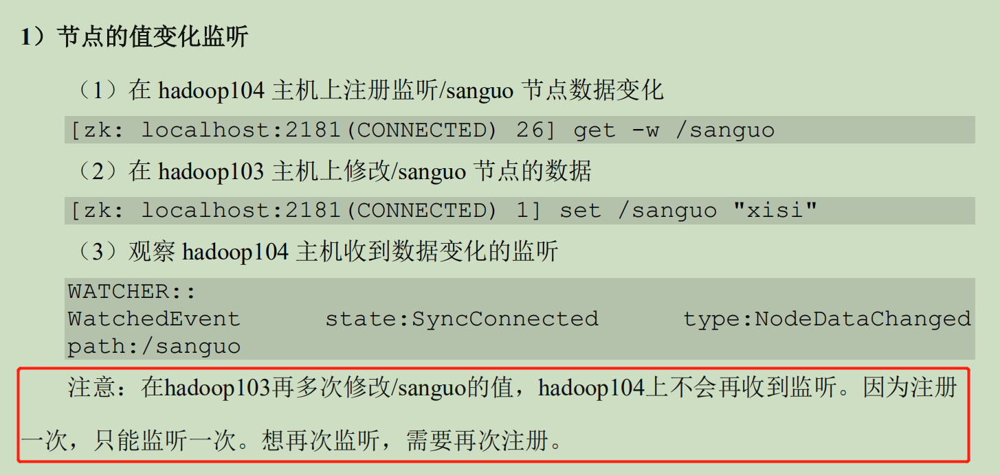

# Zookeeper

## 第一章 Zookeeper入门

### 1.1 zookeeper特点

1）Zookeeper：一个领导者(Leader)、多个跟随者(Folloewer)组成的集群；

2）集群中只要有半数以上节点存活，Zookeeper集群就能正常工作服务。所以Zookeeper适合安装奇数台服务器；

3）全局数据一致：每个Server保存一份相同的数据副本，Client无论连接到哪个Server，数据都是一致的；

4）更新请求顺序执行，来自同一个Client的更新请求按其发送顺序依次执行；

5）数据更新原子性，一次数据更新要么成功，要么失败；

6）实时性，在一定时间范围内，Client能读到最新的数据。

### 1.2 数据结构

与Unix很类似，整体上可以看做一颗树，每一个节点称做一个ZNode。每一个ZNode默认能够存储1MB数据

### 1.3 应用场景

提供的服务：统一命名服务、统一配置管理、统一集群管理、服务器节点动态上下线、软负载均衡。

#### 统一命名服务

分布式环境下，需要对应用/服务统一命名，便于识别。如：IP地址不容易记住，而域名容易记住。

#### 统一配置管理

1）分布式环境下，配置文件同步非常常见。

（1）一般要求一个集群中，所有节点的配置信息是一致的，如Kafka集群

   (2)  对配置文件修改后，希望快速同步到各个节点上

2）配置管理交给Zookeeper实现

   (1)  可将配置信息写入Zookeeper上的一个Znode

   (2)  各个客户端服务器监听这个Znode

#### 统一集群管理

1）  分布式环境中，实时掌握每个节点的状态是必要的。

​     （1）可根据节点实时状态做出一些调整

2） Zookeeper可以实现实时监控节点状态变化

​      （1）可将节点信息写入Zookeeper上的一个ZNode

​         (2)  监听这个ZNode可以获取它的实时状态变化

 #### 服务器动态上下线

客户端实时洞察到服务器上下线的变化

#### 软负载均衡

在Zookeeper中记录每台服务器的访问数，让访问数最少的服务器去处理最新的客户端请求

## 第二章 Zookeeper集群操作

### 2.1 选举机制

#### 第一次启动


可参考

> https://www.jianshu.com/p/c2ced54736aa
>
> 其中ZXID表示事务ID，具体情况再具体了解
>
> https://zhuanlan.zhihu.com/p/95016577?from_voters_page=true

#### 非第一启动

### 2.2 客户端命令行操作

#### 2.2.1 命令行语法

| 命令      | 功能描述                                                     |
| --------- | ------------------------------------------------------------ |
| help      | 显示所有操作命令                                             |
| ls path   | 使用ls命令查看当前znode的子节点[可监听]<br />-w 监听子节点变化<br />-s  附加次级信息 |
| create    | 普通创建<br />-s 含有序列<br />-e 临时节点 重启或超时 就会消失 |
| get path  | 获得节点的值 [可监听] <br />-w 监听节点内容变化<br />-s 附加次级信息 |
| set       | 设置节点状态                                                 |
| delete    | 删除节点                                                     |
| deleteall | 递归删除节点                                                 |
|           |                                                              |
|           |                                                              |

#### 2.2.2 znode节点数据信息

1） 查看当前节点信息

ls -s /


1) czxid：创建节点的事务zxid

   每次修改Zookeeper状态都会产生一个Zookeeper事务ID。事务ID是Zookeeper中所有修改总的次序。每次修改都有唯一的zxid，如果如果 zxid1 小于 zxid2，那么 zxid1 在 zxid2 之

   前发生

2) ctime：znode 被创建的毫秒数

3) mzxid：znode 最后更新的事务 zxid

4) mtime：znode 最后修改的毫秒数

5) pZxid：znode 最后更新的子节点 zxid？？？

6) cversion：znode 子节点变化号，znode 子节点修改次数 

7) dataversion：znode 数据变化号

8) aclVersion：znode 访问控制列表的变化号

9) ephemeralOwner：如果是临时节点，这个是 znode 拥有者的 session id。如果不是

   临时节点则是 0

10) dataLength：znode 的数据长度

11) numChildren：znode 子节点数量

#### 2.2.4 监听器



2）节点的子节点变化监听


## 第五章 Zookeeper分布式锁

​	每个znode节点最大数据为1MB

分布式锁：在“进程1”在使用资源的时候，会先去获得锁，“进程1”获得锁后，会对该资源保持独占，这样其他进程就无法访问该资源，“进程1”用完该资源，让其他进程来获得锁。


```java
public class DistributedLock {

    private String connectString = "zookeeper-1:2181,zookeeper-2:2181,zookeeper-3:2181";
    private int sessionTimeout = 2000;
    private ZooKeeper zk;

    private CountDownLatch connectLatch = new CountDownLatch(1);
    private CountDownLatch waitLatch = new CountDownLatch(1);

    private String waitPath;  //
    private String currentMode; //

    public DistributedLock() throws IOException, InterruptedException, KeeperException {

        // 获取连接
        zk = new ZooKeeper(connectString, sessionTimeout, new Watcher() {
            @Override
            public void process(WatchedEvent watchedEvent) {
                // connectLatch 如果连接上zk，则可以释放
                if (watchedEvent.getState() == Event.KeeperState.SyncConnected) {
                    connectLatch.countDown();
                }

                if (watchedEvent.getType() == Event.EventType.NodeDeleted && watchedEvent.getPath().equals(waitPath)) {
                    waitLatch.countDown();
                }
            }
        });

        // zk正常连接后，往下走程
        connectLatch.await();

        // 判断根节点/locks是否存在
        Stat stat = zk.exists("/locks", false);

        if (stat == null) {
            zk.create("/locks", "/locks".getBytes(), ZooDefs.Ids.OPEN_ACL_UNSAFE, CreateMode.PERSISTENT);
        }
    }

    // zk加锁
    public void zkLock() throws KeeperException, InterruptedException {
        // 创建对应的临时带序号节点
        currentMode = zk.create("/locks" + "seq-",null, ZooDefs.Ids.OPEN_ACL_UNSAFE, CreateMode.EPHEMERAL_SEQUENTIAL);

        // wait一小会, 让结果更清晰一些
        Thread.sleep(10);

        // 判断创建的节点是否是最小的序号节点，如果是获取到锁；如果不是，监听他序号前一个节点
        List<String> children = zk.getChildren("/locks", false);

        // 如果children只有一个值，则获得锁
        if (children.size() == 1) {
            return;
        }

        Collections.sort(children);

        // 获取节点名称 seq-00000000
        String thisNode = currentMode.substring("/locks/".length());
        // 通过 seq-00000000 获取节点在集合中的位置
        int index = children.indexOf(children);
        if (index == -1) {
            System.out.println("数据异常");
            return;
        } else if (index == 0) {
            // 只有一个节点，就可以获取锁。也就是当前节点是最小序列节点
            return;
        } else {

            // 需要监听它前一个节点的变化
            waitPath = "/locks/" + children.get(index - 1);
            zk.getData(waitPath, true, new Stat());

            // 等待监听
            waitLatch.await();
            return;
        }

    }

    // 解锁
    public void unZkLock() {

        // 删除节点
        try {
            zk.delete(this.currentMode,-1);
        } catch (InterruptedException e) {
            e.printStackTrace();
        } catch (KeeperException e) {
            e.printStackTrace();
        }

    }
}
```

## 第六章 分布式一致性算法

​	一致性算法的定义

>  一致性就是数据一致性，在分布式系统中，可以理解为多个节点中的数据是一致的。		

​	一致性算法分类：

* **强一致性**
  + 说明：保证系统改变提交以后立即改变集群的状态。
  + 模型：
    + paxos
    + raft(muti-paxos)
    + zab(muti-paxos)
* **弱一致性**
  + 说明：也叫最终一致性，系统不保证改变提交以后立即改变集群的状态，但是随着时间的推移，最终状态也是一致的。
  + 模型：
    + DNS系统
    + Gossip协议

### 6.1 paxos

### 6.2 raft

