# 计算机系统基础知识

待完成

## 计算机系统基本组成

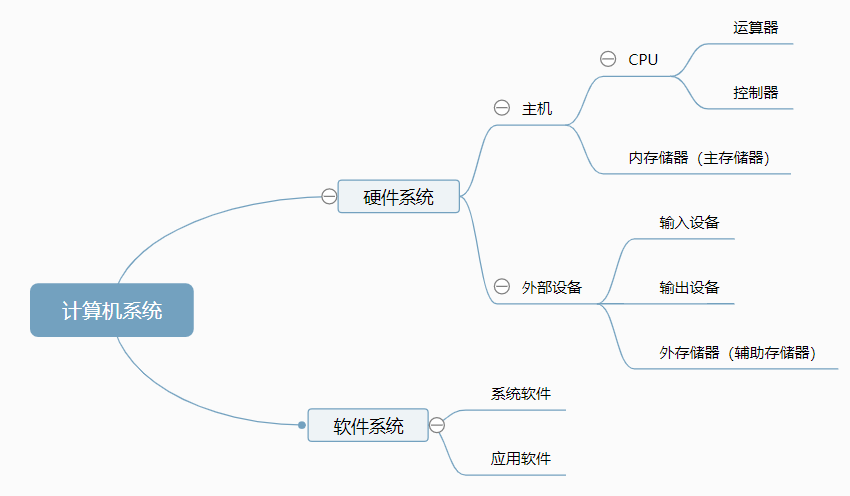

基本的计算机硬件系统由运算器、控制器、存储器、输入设备和输出设备5大部件组成。

CPU：运算器+控制器。运算器：算术与逻辑运算。控制器：从主存中取出指令并进行分析，控制计算机的各个部件有条不紊地完成指令的功能。

定点小数，由程序设计规定规则。

浮点数：IEEE-754标准

> 计算机存储： 符号位(1位) + 阶码(8位)+尾数(23位)

1. 单精度格式(float)：符号位1位，阶码8位，阶码偏移量127(即原阶码加127)

   例：20.5为正数，符号位为0，有（20.5）10 = (10100.1)2 = 1.01001 * 24

   ​        原阶码偏移127后：127+4 = （131）10 = (10000011)2

   ​         尾数23位：01001000000000000000000

   故20.5的单精度浮点表示为 0 10000011 01001000000000000000000

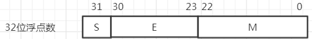

> S是浮点数的符号位，占1位，安排在最高位，S=0表示正数，S=1表示负数。M是尾数，放在低位部分，占用23位，小数点位置放在尾数域最左（最高）有效位的右边。E是阶码，占用8位，阶符采用隐含方式，，即采用移码方法来表示正负指数。移码方法对两个指数大小的比较和对阶操作都比较方便，因为阶码域值大者其指数值也大。采用这种方式时，将浮点数的指数真值e变成阶码E时，应将指数e加上一个固定的偏移值127（01111111），即E=e+127。

2. BCD码：每位十进制数用4位二进制数编码表示。选用0000~1001表示0~9

3. 字符编码：ASCII码，用7位二进制数表示一个字符：实际存储时，每个字符用一个字节存储，最高位设置为0。**'0'的ASCII码为48，'a'的ASCII码为97，‘A’为65**

4. 奇偶校验码：奇校验和偶校验。1的个数是奇数还是偶数

   奇数个1或者偶数个1。

   例如：检测ASCII码 大写字母A

   >   奇校验  正确的码为 11000001
   >
   >   错1位 11000011变成了偶数个1，能检测出错误
   >
   >   错2位 11000010变成了偶数个1，能检测出错误
   >
   >   错3位 11001010变成了偶数个1，能检测出错误

   > 偶校验  正确的码流为01000001
   >
   > 错1位 01000011变成奇数个1，能检测出错误
   >
   > 错2位											无法检测出错误
   >
   > 错3位                                            能检测出错误

海明码：在传输码列中加上冗余，每个数据位由确定位置关系的校验位来校验。用于多位并行数据检错纠错处理。

循环冗余校验码(CRC)：

## 计算机基本组成

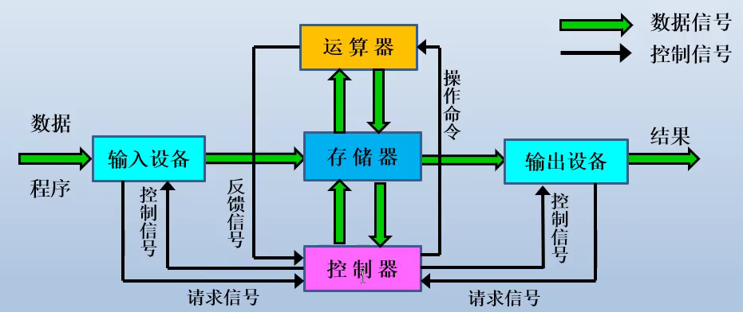

​		总线BUS：为了实现微处理器、存储器和外部输入/输出设备之间的信息链接，微机系统采用了总线结构。按照功能划分：**地址总线(AB)、数据总线(DB)和控制总线(CB)**三类。

  	 微机系统的性能指标：

+ 字长：指计算机处理指令或数据的二进制位数。微机的字长有16位、32位和64位
+ 速度：每秒钟执行的指令条数，也常用CPU的主频来表示。
+ 容量：指内存的容量。

## 输入/输出技术

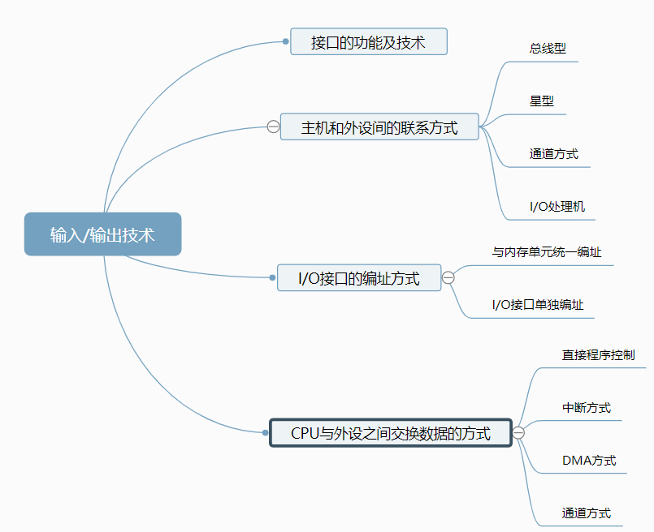

​		接口：又称界面，两个相对独立的子系统之间的相连部分。用于连接主机和I/O设备的转化机构就是I/O接口电路。

​		I/O接口主要功能如下。

* 地址译码功能
* 在主机和I/O设备间交换数据，控制命令及状态信息
* 支持主机采用程序查询、中断、DMA等方式
* 提供主机和I/O设备所需要的缓冲，暂存，驱动功能
* 进行数据的类型、格式等方面的转化

接口的分类：

* 按数据的传送格式分为并行接口和串行接口
* 按主机访问I/O设备的控制方式，可分为程序查询接口、中断接口、DMA接口以及通道控制器、I/O处理机等。
* 提供主机和I/O设备所需要的缓存、暂存、驱动功能
* 按时序控制方式可分为同步接口和异步接口

### 输入/输出接口的编址方式

1）与内存单元统一编址

​		将I/O接口中有关的寄存器或存储器部件看作存储器单元，与主存中的存储单元统一编址

2）I/O接口单独编址

​		通过设置单独的I/O地址空间，为接口中的有关寄存器或者存储部件分配单独地址码

### CPU与外设之间交换数据的方式

1）直接程序控制

​		程序查询方式：CPU通过执行程序查询外设的状态，判断外设是否准备好进行数据传送。

​       立即程序传送方式：I/O接口总是接收来自主机的数据，或随时准备向主机输入数据。

2）中断方式

​	   中断是发生在一个外部事件时，调用相应处理程序的过程。中断服务程序与中断时CPU正在运行的程序是相互独立的，相互不传递数据。

3）DMA方式

​		用于高速外围设备与内存之间批量数据传输，其使用一个专门的DMA控制器来完成内存与设备之间直接数据传输方式，不用CPU干预。当本次DMA传送的数据全部完成时，才产生中断。

4）通道方式

​		通道是一个用来控制外围设备工作的专用处理机。它对外围设备实现统一管理，代替CPU对I/O操作的控制。

## 指令系统

指令：控制计算机完成某种特定操作的命令，能被计算机识别并执行的二进制代码。

一条指令包括：**操作码(指明该指令要完成的操作)+操作数（指明操作对象的存储单元地址(内存地址)）**

指令的执行过程：就是反复地取指令、分析指令和执行指令的过程。

寻址方式：指如何确定本条指令的操作数地址以及下一条将要执行指令的地址，它与硬件结构紧密相关而且直接影响指令格式和指令功能。

1. 立即寻址，如下格式：

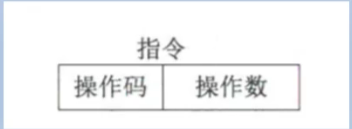

 立即寻址的形式地址A就是操作数本身，操作数在指令中直接给出。称作立即数（补码表示）

2. 直接（内存）寻址

   直接寻址EA=A，有效地址EA由形式地址A直接给出即操作数项给出内存地址编号

   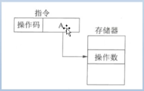

3. 间接寻址

间接地址EA=(A)，有效地址EA由形式地址A间接给出。

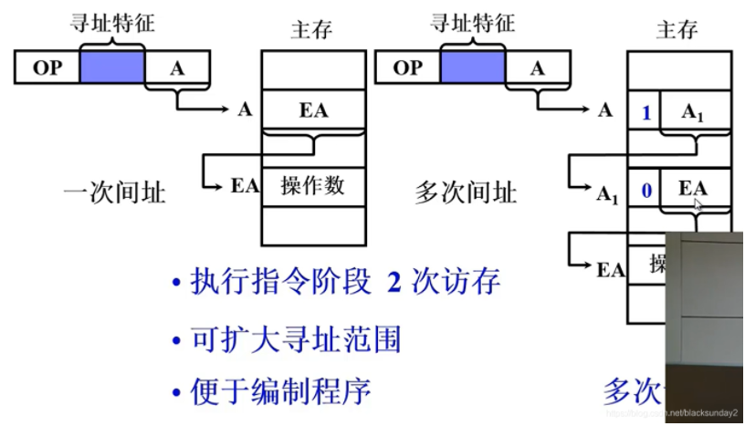

4. 寄存器（直接）寻址

   类似于上述的直接寻址，只不过是从寄存器中取值。

   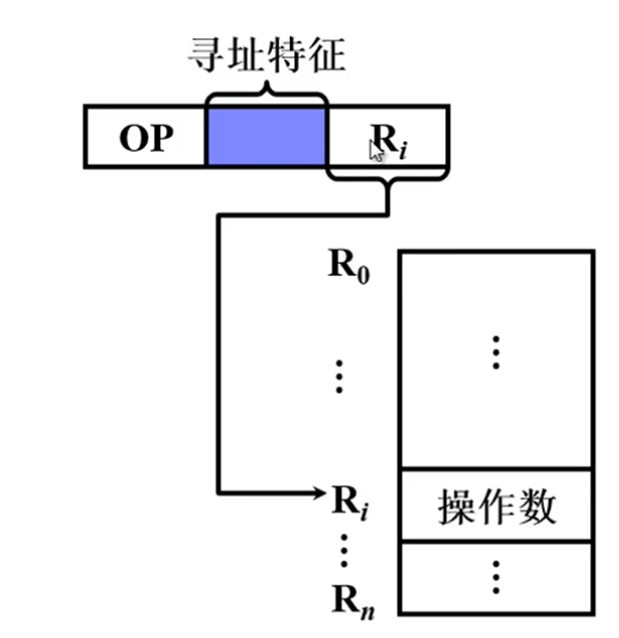

5. 寄存器（间接）寻址

   也类似于上面。

   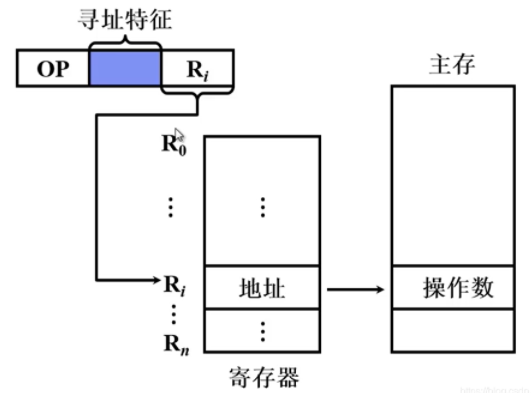

6. 基址寻址

7. 变址寻址

8. 相对寻址

   具体参考：

   > https://blog.csdn.net/blacksunday2/article/details/104799375

## 多媒体系统简介

​		媒体可分为表示媒体、感觉媒体、存储媒体、显示媒体和传输媒体五大类。

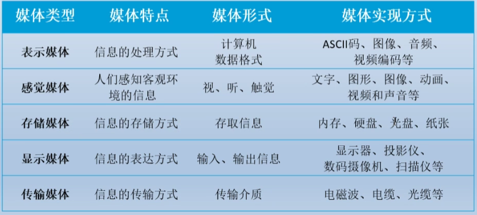

​		声音数字化：

1）采样。为了不产生失真，采样频率需要大于声音信号最高频率的两倍。

2）量化。

3）编码。

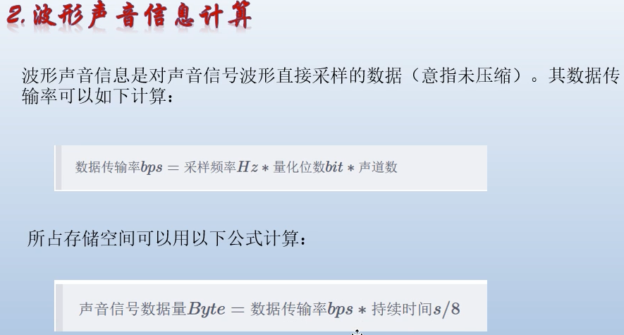

### 声音文件格式

wave(.wav)、sound(.snd)、AIFF(.aif)、Voice格式(.voc)、mp3、realAudio(ra)、midi(.mid/rmi)

### 图形与图像

## 操作系统

